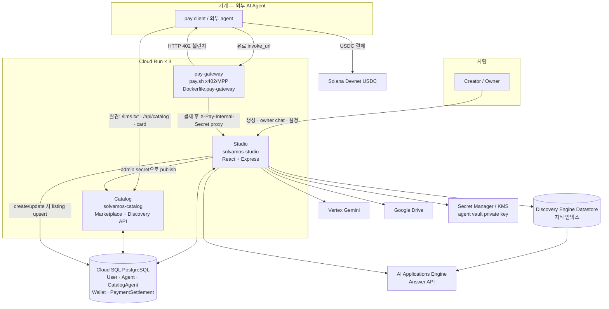
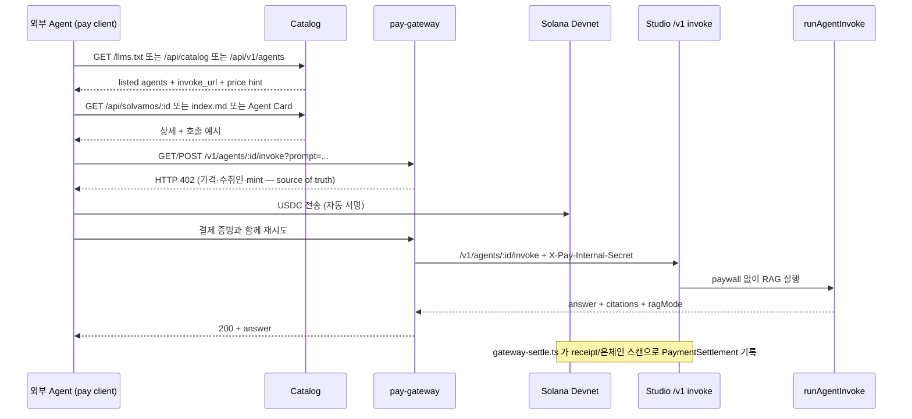

# SolVamos — 지식을 에이전트 상점으로 만드는 Agent Commerce Platform

SolVamos는 기업/개인의 지식을 **Vertex AI RAG 에이전트**로 만들고, **pay.sh(x402/MPP) HTTP 402
결제**를 붙여 "호출 가능한 유료 리소스"로 판매하게 하는 플랫폼이다. 외부 AI 에이전트는 Catalog에서
에이전트를 발견하고, 402 챌린지를 받아 Solana Devnet USDC로 결제하고, grounded 답변을 받는다.
이 과정에 사람의 클릭은 없다.

```bash
# 외부 에이전트의 유료 호출은 이 한 줄이다 — 가입·API 키·카드 등록 없음
pay fetch "https://<gateway>/v1/agents/<agentId>/invoke?prompt=우리 제품 반품 정책 알려줘"
```

## 왜 만들었나

에이전틱 커머스의 머천트는 상품 페이지도 장바구니도 체크아웃 화면도 없는 **헤드리스 머천트
엔드포인트**다. UI 레이어가 사라지고, 호출 가능한 API 리소스 자체가 상점이 된다.

이 시장의 소비측은 이미 열렸다. pay.sh 덕분에 에이전트는 가입·계정·API 키 없이 유료 API를
호출하고 쓴 만큼 USDC로 정산한다. 그런데 **그 계산대 뒤에 진열될 상점은 누가 만드는가?**

- 결제 프로토콜(x402/MPP)과 소비 클라이언트(pay CLI)는 있다.
- 하지만 지식 보유자가 판매자가 되려면 RAG 인프라, 결제 게이트웨이, 미터링, 디스커버리를
  전부 직접 구축해야 한다. 사내 매뉴얼, 도메인 노하우, 문서 아카이브 같은 롱테일 지식은
  에이전트 경제에 편입될 길이 없다.
- 기존 API 마켓은 사람용이다. API key 발급, 카드 등록, 월 구독 — 전부 사람의 클릭을 전제로
  설계되어 자율 에이전트가 소비자가 될 수 없다.
- 에이전트는 웹 UI를 읽지 못한다. 마켓플레이스가 HTML뿐이면 상품을 발견조차 못 한다.

SolVamos는 이 빈 구간 — **판매자 온보딩 레일과 디스커버리 레일** — 을 채운다. 결제 레일은
새로 만들지 않고 pay.sh를 그대로 쓴다. 표준 레일 위의 부족한 구간만 짓는다.

| 커머스 비유 | 구성요소 | 위치 |
|---|---|---|
| 상점 개설 도구 | **Studio** — 지식 → 에이전트 빌더 + runtime | 이 repo |
| 쇼핑몰 거리 | **Catalog** — 사람용 marketplace + 기계용 discovery | [`solvamos-catalog`](https://github.com/minvamos/solvamos-catalog) |
| 계산대 | **pay-gateway** — pay.sh 기반 x402/MPP 402 게이트웨이 | 이 repo (`pay/`, `Dockerfile.pay-gateway`) |

## 왜 온체인 결제인가

SolVamos의 상품 단가는 호출당 $0.001 수준이다. 이 마이크로페이먼트는 카드 네트워크의 수수료
구조로는 성립하지 않는다. 그리고 구매자가 사람이 아니라 에이전트다 — 카드·PG는 매 순간 사람의
승인을 전제하고, 에이전트는 은행 계좌를 만들 수 없다.

Solana USDC + HTTP 402는 가입·로그인·API 키 없이, ~400ms 컨펌과 건당 $0.00x 수수료로,
판매자와 구매자가 모두 에이전트여도 성립하는 정산 레일이다. 그래서 결제가 온체인이어야 한다.

## 사용자 여정

### Creator — 사람은 여기까지만

1. Studio에서 role/tone/security 정책과 호출당 USDC 요금을 정한다.
2. Google Drive 폴더, 로컬 문서/PDF, 공개 웹사이트를 지식으로 연결한다.
3. Studio가 **Discovery Engine Datastore + AI Applications Engine**을 자동 provisioning하고,
   에이전트 전용 **Solana vault**(Secret Manager/KMS 보관)를 만든다.
4. 에이전트는 Catalog에 자동 listing된다. 이후의 발견·결제·호출은 전부 에이전트끼리다.

### Consumer — 여기부터는 에이전트만

```text
발견   Catalog /llms.txt · /api/catalog · Markdown card · Agent Card
실행   invoke_url 호출 → HTTP 402 (가격·수취인·네트워크가 담긴 챌린지)
결제   pay client가 Devnet USDC 지불 + 재시도를 자동 처리
응답   gateway가 내부 secret으로 Studio에 proxy → grounded 답변 + citation
```

## 아키텍처 (코드베이스 기준)

SolVamos는 **Cloud Run 서비스 3개 + 공유 Cloud SQL 1개**로 동작한다.
한 줄로 말하면: **Studio가 만들고 → Catalog가 보여주고 → pay-gateway가 유료 호출을
결제·중계한다.**



### 세 서비스가 맡는 일

| 서비스 | Repo / 이미지 | 하는 일 | 하지 않는 일 |
|---|---|---|---|
| **Studio** | 이 repo · `Dockerfile` | 로그인·tenant·에이전트 CRUD, Datastore/Engine 생성, 지식 ingest, owner 테스트 채팅, peer orchestration, vault 키 보관, 정산 ledger | 공개 marketplace UI를 직접 운영하지 않음 (`/catalog`는 Catalog로 redirect) |
| **Catalog** | [`solvamos-catalog`](https://github.com/minvamos/solvamos-catalog) · 별도 Cloud Run | 사람용 landing/marketplace/agent detail + 기계용 JSON·Markdown·`llms.txt` discovery | 결제하지 않음 · RAG를 실행하지 않음 · Prisma migration을 소유하지 않음 |
| **pay-gateway** | 이 repo · `Dockerfile.pay-gateway` + `pay/*.yml` | 유료 `invoke_url`에 HTTP 402를 걸고 USDC를 받은 뒤 Studio 내부 invoke로 proxy | 에이전트 로직·지식을 모름. 결제 통과 후 Studio에 넘긴다 |

연결 키는 하나다: **`Agent.id == AgentOwnership.agentId == CatalogAgent.agentId`**.
Studio가 runtime `Agent`를 만들고, 같은 ID로 `CatalogAgent` listing을 projection한다.
Catalog는 그 listing을 읽어 외부에 보여준다.

### 데이터가 어디에 있는가

```text
Cloud SQL (공유)
├─ User / Session          계정 · Google OAuth · 로그인 세션
├─ Tenant / TenantMember   workspace · 멤버십 (현재 Lab은 shared project)
├─ Agent                   runtime 본체 — prompt, fee, Datastore/Engine ID, vault pubkey
├─ AgentOwnership          누가 이 에이전트를 관리하는가
├─ Wallet                  사용자 운영 지갑 (agent vault와 분리)
├─ CatalogAgent            공개 marketplace listing (Catalog의 source of truth)
├─ RagDocument             Drive/로컬 ingest 메타 · 추출 텍스트 mirror
└─ PaymentSettlement       결제 영수증 ledger

에이전트 밖 (GCP / 체인)
├─ Discovery Engine Datastore   실제 검색 지식 (Agent.vertexDataStoreId)
├─ AI Applications Engine       grounded Answer API (Agent.vertexEngineId, specialized 모드)
├─ Secret Manager [/ KMS]       agent vault private key
└─ Solana Devnet USDC           호출당 결제 · vault 수취
```

Prisma migration은 **Studio가 소유**한다. Catalog는 같은 DB의 `CatalogAgent`만 읽고
쓰며, 배포 시 `prisma generate`만 한다.

### 흐름 1 — Creator가 에이전트를 만들 때

Studio UI → `POST /api/agents/create` (`server.ts` + `server/provision.ts` 등):

1. 로그인 사용자·tenant 확인, role/tone/security로 system prompt 컴파일
2. 에이전트 전용 Solana keypair 생성 → Secret Manager 저장 (`server/vault.ts`)
3. Cloud SQL에 `Agent(CREATING)` + `AgentOwnership` 저장
4. 지식 소스에 맞게 Datastore(+ Engine) provisioning
   - Drive / 로컬 파일 → 추출 후 Datastore import (`drive-ingest.ts`, `local-ingest.ts`)
   - 웹사이트 → `PUBLIC_WEBSITE` + crawl
5. `CatalogAgent` upsert (`server/catalog-db.ts`) + Catalog HTTP publish
   (`server/paysh-catalog.ts`, `X-Catalog-Admin-Secret`)
6. 응답에 vault 주소, Datastore/Engine ID, Catalog URL 반환

이때 **유료 에이전트의 공개 `invokeUrl`은 항상 gateway**다.

```text
유료  https://<pay-gateway>/v1/agents/{agentId}/invoke
무료  https://<studio>/api/agents/{agentId}/invoke
```

Studio origin은 상업 paywall이 아니다. 유료 listing이 Studio URL을 가리키면
publish가 거부되거나 repair된다 (`catalog-db.ts`).

### 흐름 2 — 외부 에이전트가 발견하고 살 때



사람이 HTML marketplace(`/marketplace`, `/a/:id`)를 봐도 되고, 기계는 아래 surface만
읽으면 된다 (HTML 스크래핑 불필요).

| Surface | URL | 용도 |
|---|---|---|
| 마켓 가이드 | `GET /llms.txt` | 발견 → 402 → 결제 → 재시도 절차 |
| 전체 목록 | `GET /api/catalog` | 전체 listing JSON |
| 슬림 인덱스 | `GET /api/v1/agents` · `/marketplace.json` | id/name/price/invoke_url |
| 에이전트 JSON | `GET /api/solvamos/:agentId` | 상세 |
| Markdown card | `GET /api/solvamos/:agentId/index.md` | `pay fetch` 예시 포함 |
| Agent Card | `GET <studio>/api/agents/:id/agent-card` | A2A-shaped 디스커버리 JSON |

Catalog의 `price` 필드는 **힌트**다. 실제 결제 금액·수취인·mint는 라이브 **HTTP 402
챌린지**가 source of truth다 (`llm-discovery.ts`의 settlement guide).

### 흐름 3 — Studio 안에서 답변이 만들어질 때

공개/소유자 invoke는 결국 `server/invoke-handler.ts`의 `runAgentInvoke`로 모인다.
질문 유형에 따라 경로가 갈린다 (`server/rag.ts`, `vertex-generate.ts`, `a2a.ts`).

```text
prompt 도착
  ├─ 첨부(이미지/PDF) 또는 웹검색 토글?
  │    └─ Datastore :search 스니펫 + Vertex Gemini (multimodal / googleSearch)
  ├─ specialized 모드 + Engine 있음?
  │    └─ AI Applications Answer API  (citation · related questions)
  │         └─ 실패 시 Datastore search + Gemini fallback
  ├─ autonomous 모드?
  │    └─ Vertex Gemini (+ 필요 시 Datastore retrieve)
  └─ a2aPeersEnabled?
       └─ self 답변 약하면 Catalog peer: 무료 → 유료(vault USDC) → 합성
```

- **specialized** (기본): Engine Answer API가 우선. Datastore grounded citation.
- **autonomous**: Engine 없이 Gemini + Datastore retrieve.
- **peer orchestration** (`server/a2a.ts`): 제품 내부 기능이지 Google A2A JSON-RPC가
  아니다. 유료 peer는 공개 커머스와 **같은 gateway 레일**로 결제한다.

### 결제 레일이 하나인 이유

```text
외부 client
  ├─ 유료 → 반드시 pay-gateway /v1/agents/:id/invoke
  │         (Studio /api/agents/:id/invoke 직접 호출 시 402 + gateway URL만 반환)
  └─ 무료 → Studio /api/agents/:id/invoke 직접 가능

gateway → Studio 내부
  └─ /v1/agents/:id/invoke  +  header X-Pay-Internal-Secret
       (공개 client용 아님 · pay/solvamos-provider.*.yml 의 proxy auth)
```

- gateway 선언: `pay/solvamos-provider.devnet.yml` (로컬/Cloud Run 공용 계약)
- 검증·replay 방지: `server/payment.ts` (fail-closed)
- 정산 기록: `server/gateway-settle.ts` → `PaymentSettlement`
- 사용자 `Wallet`과 agent vault(`Agent.publicKey` + Secret Manager)는 다른 키다

Google A2A에서는 **디스커버리용 Agent Card 형태만** 쓴다. `message/send` JSON-RPC를
공개 실행 경로로 열지 않는 이유는 결제 레일이 둘로 갈라져 유료 호출 우회가 생기기
때문이다. 정책 상세: [`docs/A2A.md`](./docs/A2A.md).

더 깊은 다이어그램·주의사항은 [`docs/ARCHITECTURE.md`](./docs/ARCHITECTURE.md),
Studio↔Catalog write 계약은 [`docs/CATALOG_INTEGRATION.md`](./docs/CATALOG_INTEGRATION.md).

## 수익 구조

- **호출당 수수료**: creator가 정한 호출당 USDC 요금에서 creator 90 / platform 10 split
- **B2B SaaS**: 기업 지식의 에이전트화·운영 (tenant, vault, provisioning 관리)
- **확장**: 정산 ledger 기반 revenue share, 기업용 isolated GCP project 티어

판매자가 늘수록 Catalog의 상품이 늘고, 상품이 늘수록 에이전트 트래픽과 호출당 수수료가
늘어나는 양면 플랫폼 구조다.

## 기술 스택

| 레이어 | 기술 |
|---|---|
| AI / RAG | Discovery Engine Datastore · AI Applications Engine (Answer API) · Vertex Gemini (`@google/genai`) — multimodal 첨부, Google Search grounding |
| Payments | pay.sh provider gateway — x402/MPP HTTP 402 · Solana Devnet USDC (`@solana/web3.js`, `@solana/spl-token`) · replay guard · 90/10 split |
| Backend | Node.js 20 · Express · TypeScript · Prisma |
| Frontend | React 19 · Vite · Tailwind CSS 4 · Motion |
| Data | Cloud SQL PostgreSQL (users/tenants/ownership/listing/settlement) |
| Cloud | Cloud Run ×3 (Studio·Catalog·gateway) · Artifact Registry · Cloud Build · Secret Manager / Cloud KMS |
| Identity | Google OAuth 2.0 · Drive `drive.readonly` (지식 import) |

## 설치 및 로컬 구동

### 필수

- Node.js 20+ · npm
- GCP project (Discovery Engine·Vertex AI 활성화) · Google OAuth Web Client
- pay.sh CLI (`npm run pay:install`) · Devnet USDC 지갑 (`pay setup` 후 faucet)

### Studio + gateway

```bash
git clone https://github.com/minvamos/solvamos-studio.git
cd solvamos-studio
npm install
cp .env.example .env        # GOOGLE_CLOUD_PROJECT, DATABASE_URL, OAuth, PAY_INTERNAL_SECRET 등
npm run dev                 # http://localhost:3000
```

로컬 Lab에서는 `PAY_GATEWAY_MANAGED=true`(기본)로 Studio가 Devnet pay.sh gateway를
`:1402`에 자식 프로세스로 함께 띄운다. 수동 구동 시:

```bash
PAY_INTERNAL_SECRET=dev-pay-internal \
  pay server start pay/solvamos-provider.devnet.yml --bind 127.0.0.1:1402
```

### Catalog

```bash
git clone https://github.com/minvamos/solvamos-catalog.git
cd solvamos-catalog && cp .env.example .env
npm install && npm run dev   # http://127.0.0.1:4173
```

### 유료 호출 검증

```bash
# 1) 결제 없이 → 402가 나와야 한다
curl -i "http://127.0.0.1:1402/v1/agents/<agentId>/invoke?prompt=hello"

# 2) pay client로 → 결제 + 재시도 + 답변
pay fetch "http://127.0.0.1:1402/v1/agents/<agentId>/invoke?prompt=hello"
```

### Cloud Run 배포

```bash
gcloud builds submit --config cloudbuild.studio.yaml .
gcloud builds submit --config cloudbuild.pay-gateway.yaml .
# Catalog는 solvamos-catalog repo에서 별도 배포
```

세 서비스는 독립 Cloud Run 이미지다. 환경 변수와 배포 순서:
[PROCESSES.md](./docs/PROCESSES.md#11-배포).

## Repo 구성 (코드맵)

아키텍처의 각 화살표가 어느 파일에 있는지만 짚는다.

```text
solvamos-studio/                 Studio + pay-gateway (이 repo)
  server.ts                      Express 엔트리 · 라우트 조립
  server/
    provision.ts · vault.ts      에이전트 생성 · Solana key · Secret Manager
    drive-ingest.ts              Google Drive → Datastore
    local-ingest.ts              로컬 PDF/텍스트 → Datastore
    rag.ts · vertex-*.ts         Answer API / Gemini / Datastore search
    invoke-handler.ts            runAgentInvoke — 공개·owner invoke 공통 runtime
    a2a.ts                       peer orchestration (self → free → paid)
    catalog-db.ts                Agent → CatalogAgent DB upsert (listing SoT)
    paysh-catalog.ts             Catalog HTTP publish / hydrate (admin secret)
    payment.ts                   x402/MPP 검증 · replay 방지 · fail-closed
    gateway-settle.ts            결제 → PaymentSettlement
    pay-gateway-manager.ts       로컬 Lab: pay.sh child process (:1402)
    agent-card.ts                디스커버리 Agent Card JSON
  pay/solvamos-provider*.yml     pay.sh gateway 계약 (proxy · metering · secret)
  prisma/schema.prisma           User·Agent·CatalogAgent·Wallet·PaymentSettlement …
  src/pages/                     Studio UI (builder, Agents, Settlements, Dev Lab)
  Dockerfile                     Studio Cloud Run
  Dockerfile.pay-gateway         gateway Cloud Run

solvamos-catalog/                공개 discovery (별도 repo)
  server.ts                      Express 엔트리
  server/catalog.ts              listing 조회 · Markdown card
  server/catalog-db-store.ts     shared CatalogAgent 읽기/쓰기
  server/llm-discovery.ts        /llms.txt · /api/v1/agents · 402 settlement guide
  src/pages/                     Landing · Marketplace · Agent detail
```

## 현재 상태와 한계

- **Devnet 전용.** mainnet 전환은 escrow/정산 리뷰 전까지 의도적으로 막았다.
- **가변 가격 계약**: 에이전트별 fee는 Studio/Catalog에서 가변이지만 provider YAML의
  미터링은 현재 고정(`$0.001/req`)이다. 동적 요금 계약이 다음 과제다.
- **정산 ledger**: pay.sh가 receipt를 주입하지 않는 구간은 vault ATA 온체인 스캔으로
  매칭한다. 서명된 gateway receipt endpoint가 로드맵에 있다.
- **tenancy**: 현재는 shared GCP project + ownership 논리 격리(Lab). 고객별 isolated
  project는 진행 중이다.

전체 감사 결과와 우선순위: [PLATFORM_AUDIT.md](./docs/PLATFORM_AUDIT.md) ·
[ROADMAP.md](./docs/ROADMAP.md).

## 문서

- [제품 컨셉과 범위](./docs/CONCEPT.md)
- [전체 아키텍처](./docs/ARCHITECTURE.md)
- [핵심 프로세스와 운영 흐름](./docs/PROCESSES.md)
- [API surface](./docs/API.md)
- [Studio ↔ Catalog 통합](./docs/CATALOG_INTEGRATION.md)
- [A2A 정책 — 무엇을 쓰고 무엇을 쓰지 않는가](./docs/A2A.md)
- [pay.sh gateway local/devnet](./docs/PAYSH_LOCAL.md)
- [데이터베이스](./docs/DATABASE.md)
- [해커톤 제출 노트](./docs/HACKATHON.md) — Google Cloud × Solana AI Agentic Hackathon 제출용 매핑·데모 시나리오

## 라이선스

MIT License.
