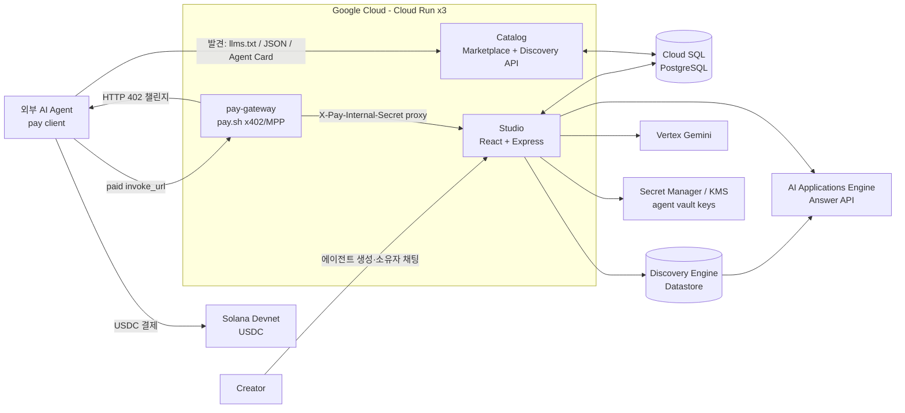
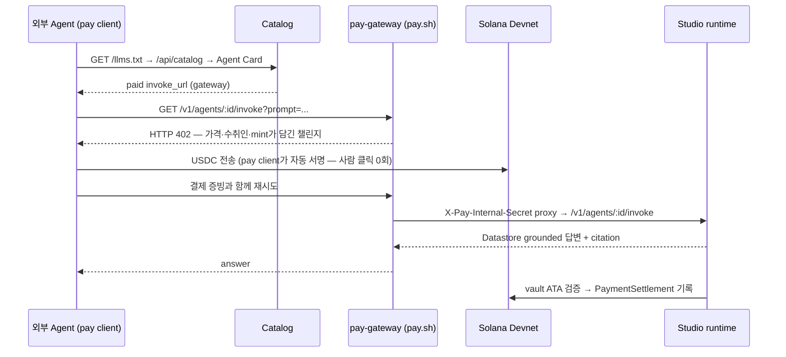

# SolVamos — 지식을 에이전트 상점으로 만드는 Agent Commerce Platform

> **Google Cloud × Solana AI Agentic Hackathon** · Track A(Agent-Initiated Commerce) × C(Multi-Agent Commerce)
>
> 기업/개인의 지식을 **Vertex AI RAG 에이전트**로 만들고, **pay.sh(x402/MPP) HTTP 402 결제**를 붙여
> "호출 가능한 유료 리소스"로 판매한다. 외부 AI 에이전트는 **Catalog에서 발견 → 402 챌린지 →
> Devnet USDC 결제 → 답변 수신**까지 사람 클릭 0회로 끝낸다.

**Vertex AI로 답하고 · Catalog로 발견되고 · pay.sh 402로 정산한다.** (Solana Devnet USDC)

---

## 1. 컨셉 — "호출 가능한 리소스가 곧 상점이다"

에이전틱 커머스의 머천트는 상품 페이지도, 장바구니도, 체크아웃 화면도 없는
**헤드리스 머천트 엔드포인트**다. UI 레이어가 사라지고 API 엔드포인트 자체가 판매 접점이 된다.

pay.sh는 이 시장의 **수요측**을 열었다 — 에이전트가 가입·계정·API 키 없이 유료 API를
호출하고 쓴 만큼 USDC로 정산한다. 그런데 그 계산대 뒤에 진열될 **상점은 누가, 어떻게 만드는가?**

**SolVamos는 공급측의 답이다.** 코드를 못 쓰는 지식 보유자도 Drive 폴더·문서·웹사이트를
연결하면, SolVamos가 그것을 **grounded RAG 에이전트 → pay.sh 뒤의 유료 402 엔드포인트 →
Catalog에 listing된 발견 가능한 상점**으로 만들어 준다.

한 문장으로: **relay 같은 구매 에이전트가 "에이전트 손님"이라면, SolVamos는 그 손님이 들를
상점 거리를 찍어내는 "에이전트 상거래의 Shopify"다.**

| 커머스 비유 | SolVamos 구성요소 |
|---|---|
| 상점 개설 도구 | **Studio** — 지식 → 에이전트 빌더 + runtime (이 repo) |
| 쇼핑몰 거리 | **Catalog** — 사람용 marketplace + 기계용 discovery ([`solvamos-catalog`](https://github.com/minvamos/solvamos-catalog)) |
| 계산대 | **pay-gateway** — pay.sh 기반 x402/MPP 402 게이트웨이 (이 repo, `pay/`) |

## 2. 문제와 타깃

- **공급측 레일이 비어 있다.** 결제 프로토콜(x402/MPP)과 소비 클라이언트(pay CLI)는 이미
  있지만, 지식 보유자가 판매자가 되려면 RAG 인프라·결제 게이트웨이·미터링·디스커버리를
  전부 직접 구축해야 한다. 롱테일 지식(사내 매뉴얼, 도메인 노하우, 문서 아카이브)은
  에이전트 경제에 편입될 길이 없다.
- **기존 API 마켓은 사람용이다.** API key 발급, 카드 등록, 월 구독 — 전부 사람의 클릭을
  전제로 설계되어 자율 에이전트가 소비자가 될 수 없다.
- **에이전트는 웹 UI를 읽지 못한다.** 마켓플레이스가 HTML뿐이면 에이전트는 상품을
  발견조차 못 한다. 기계가 읽는 카탈로그·가격·결제 계약이 필요하다.

**타깃**: ① 도메인 지식을 유료 에이전트로 팔고 싶은 기업/개인 creator(판매자),
② 외부 지식을 필요한 순간에만 호출당 결제로 소비하려는 AI 에이전트와 그 운영자(구매자).

## 3. 당위성 — 4가지 질문에 답한다

### Q1. 왜 블록체인(Solana) 기반 결제여야 하나?

SolVamos의 상품 단가는 **호출당 $0.001 수준**이다. 이 마이크로페이먼트는 카드
네트워크의 수수료 구조로는 성립하지 않는다. 그리고 구매자가 사람이 아니라 에이전트다 —
카드·PG는 매 순간 사람의 승인을 전제하고, 에이전트는 계좌를 만들 수 없다.
Solana USDC + 402는 **가입·로그인·API 키 없이**, ~400ms 컨펌과 $0.00x 수수료로,
판매자와 구매자가 모두 에이전트여도 성립하는 유일한 정산 레일이다.

### Q2. 어느 시장을 노리나?

기존 커머스의 재편이 아니라, **"에이전트가 지식·능력을 사고파는" 새로 열리는 시장**이다.
추천만 받는 단계를 지나 위임형·자율형 에이전트가 실구매자가 되는 시점에, 그들이 살 수 있는
상품(기계가 발견·결제·호출 가능한 지식 API)의 공급이 병목이다. SolVamos는 그 공급을
만들어내는 B2B SaaS다.

### Q3. 어느 레이어를 노리나? — 어떤 레일이 부족한가

커머스&체크아웃 스택에서 **판매자 온보딩 레일**이 비어 있다.

```text
결제 프로토콜   x402 / MPP            ✅ 있음 (Coinbase·커뮤니티)
소비 클라이언트  pay CLI / pay fetch    ✅ 있음 (pay.sh)
판매자 온보딩   지식 → 유료 402 엔드포인트  ❌ ← SolVamos Studio
디스커버리     기계가 읽는 카탈로그·가격 계약  ❌ ← SolVamos Catalog
```

Studio가 온보딩 레일을, Catalog가 디스커버리 레일을 채운다. 결제 레일은 새로 만들지 않고
**pay.sh를 그대로 쓴다** — 표준 레일 위의 부족한 구간만 짓는 것이 우리의 해자다.

### Q4. 현재 시장은 무엇을 타겟으로 하는가

pay.sh 카탈로그의 70+ 유료 API는 **이미 존재하는 API**(검색·데이터·이미지 생성)를 연결한
것이다. SolVamos는 아직 API가 아닌 **롱테일 지식을 신규 상품으로 발행**해 공급 자체를
확장한다. Cloudflare Monetization Gateway가 "기존 콘텐츠에 계산대 달기"라면, SolVamos는
"지식으로 상점 개업시키기"다.

## 4. 솔루션과 아키텍처

### Creator 여정 (사람은 여기까지만)

1. Studio에서 role/tone/security 정책과 **호출당 USDC 요금**을 정한다.
2. Google Drive 폴더, 로컬 문서/PDF, 공개 웹사이트를 지식으로 연결한다.
3. Studio가 **Discovery Engine Datastore + AI Applications Engine**을 자동 provisioning하고,
   에이전트 전용 **Solana vault**(Secret Manager/KMS 보관)를 만든다.
4. 에이전트는 Catalog에 자동 listing된다. 이후의 발견·결제·호출은 전부 에이전트끼리다.

### Consumer 여정 (여기부터는 에이전트만)

```bash
# 외부 에이전트의 유료 호출은 이 한 줄이다 — 가입·API 키·카드 등록 없음
pay fetch "https://<gateway>/v1/agents/<agentId>/invoke?prompt=우리 제품 반품 정책 알려줘"
```

### 시스템 토폴로지



### 주문 1건 end-to-end



### 대화 runtime — 하나의 모델 호출이 아니다

질문 유형에 따라 근거·비용·도구 요구가 다르므로 runtime이 경로를 분기한다.

- **text RAG**: AI Applications Engine **Answer API** (Datastore grounded, citation 포함)
- **첨부(이미지/PDF)**: Datastore search + **Vertex Gemini multimodal**
- **실시간 웹**: Datastore search + Gemini **Google Search grounding**
- **비용 인식 peer orchestration** (Track C 요소): 자기 지식으로 부족하면 Catalog에서
  **무료 peer → 유료 peer** 순서로 계획·호출한다. 유료 peer는 자기 vault의 USDC로
  결제한다 — **에이전트가 다른 에이전트의 유료 고객이 되는** A2A 커머스 경로이며,
  공개 커머스와 동일한 정산 레일을 쓴다.

## 5. 결제·디스커버리 프로토콜

### x402/MPP — 402가 계약이다

- **결제의 source of truth는 라이브 HTTP 402 챌린지다.** Catalog의 가격 필드는 discovery
  힌트일 뿐이며, 클라이언트는 402 챌린지에서만 트랜잭션을 빌드한다. 가격 변경·스플릿이
  카탈로그 갱신에 의존하지 않는다.
- **상업 레일은 하나다.** 유료 실행은 gateway `invoke_url`이 유일하다. 유료 에이전트의
  Studio origin 직접 호출은 실행 없이 gateway URL이 담긴 402만 반환한다 — 결제 우회가
  구조적으로 불가능하다.
- **replay 방지 + fail-closed.** 온체인 서명은 1회만 인정하고, RPC 오류 시 결제를
  통과시키지 않는다. 정산은 receipt 헤더 또는 vault USDC ATA 온체인 스캔으로 검증 후에만
  `PaymentSettlement` ledger에 기록한다.
- **지갑 분리.** 사용자 wallet(운영·표시)과 agent vault(수익 수취·peer 결제)는 다른 키다.
  vault private key는 Secret Manager, 선택적으로 KMS CMEK로 보관한다.
- gateway는 pay.sh provider YAML(`pay/solvamos-provider.devnet.yml`)로 선언한다 —
  proxy routing, `X-Pay-Internal-Secret` 인증, usage 미터링.

### Catalog — 에이전트가 읽는 디스커버리

에이전트는 HTML을 스크래핑하지 않는다. Catalog는 기계용 surface를 별도로 제공한다.

- `/llms.txt` — 에이전트용 마켓 가이드 (발견 → 402 → 결제 → 재시도 절차 명시)
- `/api/catalog` · `/api/solvamos/:agentId` — 카탈로그/에이전트 JSON
- `/api/solvamos/:agentId/index.md` — Markdown agent card (`pay fetch` 예시 포함)
- Agent Card — 스킬·가격·`invoke_url`을 담은 A2A-shaped JSON

### A2A에 대한 입장 (의도적 선택)

Google A2A에서는 **디스커버리용 Agent Card 형태만** 차용한다. A2A JSON-RPC
`message/send`를 공개 실행 경로로 열지 않는 이유: 결제 레일이 둘로 갈라져 **유료 호출
우회가 생기기 때문**이다. 공개 커머스·정산은 `invoke_url` + 402가 유일하다.
상세 정책과 재도입 조건: [`docs/A2A.md`](./docs/A2A.md).

## 6. 수익모델

| 수익원 | 구조 |
|---|---|
| 호출당 수수료 | creator가 정한 호출당 USDC 요금에서 **creator 90 / platform 10** split |
| B2B SaaS | 기업 지식의 에이전트화·운영 (tenant, vault, provisioning 관리) |
| 확장 | 정산 ledger 기반 revenue share, 기업용 isolated GCP project 티어 |

판매자가 늘수록 Catalog의 상품이 늘고, 상품이 늘수록 에이전트 트래픽과 호출당 수수료가
늘어나는 **양면 플랫폼 구조**다.

## 7. 기술 스택

| 레이어 | 기술 |
|---|---|
| AI / RAG | **Discovery Engine Datastore** · **AI Applications Engine** (Answer API) · **Vertex Gemini** (`@google/genai`) — multimodal 첨부, Google Search grounding |
| Payments | **pay.sh** provider gateway — **x402/MPP** HTTP 402 · **Solana Devnet USDC** (`@solana/web3.js`, `@solana/spl-token`) · replay guard · 90/10 split |
| Backend | Node.js 20 · Express · TypeScript · Prisma |
| Frontend | React 19 · Vite · Tailwind CSS 4 · Motion |
| Data | Cloud SQL PostgreSQL (users/tenants/ownership/listing/settlement) |
| Cloud | **Cloud Run** ×3 (Studio·Catalog·gateway) · Artifact Registry · Cloud Build · **Secret Manager / Cloud KMS** |
| Identity | Google OAuth 2.0 · Drive `drive.readonly` (지식 import) |

## 8. 심사 기준 매핑

| 심사 기준 | 우리 대응 |
|---|---|
| **혁신성 및 UX** — 새로운 사용자 경험 · 문제 해결 방식 | 비개발자 지식 보유자의 "상점 개업"이라는 새 UX · "402 = source of truth" 결제 계약 · llms.txt 등 에이전트-네이티브 디스커버리 · 비용 인식 peer orchestration(에이전트가 에이전트의 고객) |
| **AI 활용도** — Gemini · Google Cloud AI 스택 완성도 | Datastore provisioning → Engine Answer API(grounded citation) → Gemini multimodal/Search grounding까지 GCP AI 스택 풀체인. 단일 모델 호출이 아닌 근거·비용 기반 runtime 분기 |
| **인프라 연동** — USDC · Solana Pay · pay.sh 연동 | pay.sh provider gateway를 상업 레일 그 자체로 사용(옵션 아님) · Devnet USDC 정산 · agent vault(Secret Manager/KMS) · Cloud Run ×3 배포 |
| **실제 구동 여부** — 실행 로그·이력 기반 트랜잭션 확인 | `curl` → 402, `pay fetch` → 실제 devnet USDC tx(explorer 확인) · replay guard 로그 · `PaymentSettlement` ledger · `ragMode`/tool trace가 담긴 invoke 응답 |

**제출물 대응**: ① 프로덕트 소개서(타깃 §2 / 문제 §2·§3 / 수익모델 §6 / 아키텍처 §4) ·
② GitHub(본 README + `.env.example` + provider YAML + 스모크 스크립트로 재현, §9) ·
③ 3분 데모 영상(실제 온체인 결제 전 과정, §10) · **BONUS** 라이브 배포 URL(Cloud Run 3 서비스).

**목업 없음**: 데모의 결제는 실제 Solana Devnet USDC 트랜잭션이며 explorer에서 검증 가능하다.

## 9. 재현 (Quick start)

### 필수

- Node.js 20+ · npm
- GCP project (Discovery Engine·Vertex AI 활성화) · Google OAuth Web Client
- pay.sh CLI (`npm run pay:install`) · Devnet USDC 지갑 (`pay setup` 후 faucet)

### Studio + gateway

```bash
git clone https://github.com/minvamos/solvamos-studio.git
cd solvamos-studio
npm install
cp .env.example .env        # GOOGLE_CLOUD_PROJECT, DATABASE_URL, OAuth, PAY_INTERNAL_SECRET 등
npm run dev                 # http://localhost:3000
```

로컬 Lab에서는 `PAY_GATEWAY_MANAGED=true`(기본)로 Studio가 Devnet pay.sh gateway를
`:1402`에 자식 프로세스로 함께 띄운다. 수동 구동 시:

```bash
PAY_INTERNAL_SECRET=dev-pay-internal \
  pay server start pay/solvamos-provider.devnet.yml --bind 127.0.0.1:1402
```

### Catalog

```bash
git clone https://github.com/minvamos/solvamos-catalog.git
cd solvamos-catalog && cp .env.example .env
npm install && npm run dev   # http://127.0.0.1:4173
```

### 유료 호출 검증 (판정 포인트)

```bash
# 1) 결제 없이 → 402가 나와야 한다
curl -i "http://127.0.0.1:1402/v1/agents/<agentId>/invoke?prompt=hello"

# 2) pay client로 → 결제 + 재시도 + 답변 (사람 클릭 0회)
pay fetch "http://127.0.0.1:1402/v1/agents/<agentId>/invoke?prompt=hello"
```

### Cloud Run 배포

```bash
gcloud builds submit --config cloudbuild.studio.yaml .
gcloud builds submit --config cloudbuild.pay-gateway.yaml .
# Catalog는 solvamos-catalog repo에서 별도 배포
```

세 서비스는 독립 Cloud Run 이미지다. 환경 변수와 배포 순서:
[PROCESSES.md](./docs/PROCESSES.md#11-배포).

## 10. 3분 데모 시나리오

1. **[0:00–0:45] 지식 → 상점 개업.** Studio에서 Drive 폴더/PDF를 연결해 에이전트 생성.
   Datastore+Engine provisioning과 agent vault 주소가 화면에 표시된다.
2. **[0:45–1:15] 발견.** Catalog marketplace에 방금 만든 에이전트가 listing.
   `/api/solvamos/<id>/index.md`와 `/llms.txt`를 열어 에이전트가 읽는 discovery 계약을 보여준다.
3. **[1:15–2:15] 자율 결제 호출.** 터미널에서 `curl` → **HTTP 402** 확인,
   `pay fetch` → USDC 결제 + grounded 답변(citation 포함) 수신. 사람 클릭 0회.
4. **[2:15–3:00] 정산 증빙.** Solana explorer에서 실제 tx 확인, Studio Settlements
   화면에서 `PaymentSettlement` ledger 확인. creator vault에 수익이 도착했다.

## 11. 정직한 현재 상태 (Known limitations)

- **Devnet 전용.** mainnet 전환은 escrow/정산 리뷰 전까지 의도적으로 막았다.
- **가변 가격 계약**: 에이전트별 fee는 Studio/Catalog에서 가변이지만 provider YAML의
  미터링은 현재 고정(`$0.001/req`)이다. 동적 요금 계약이 다음 과제다.
- **정산 ledger**: pay.sh가 receipt를 주입하지 않는 구간은 vault ATA 온체인 스캔으로
  매칭한다. 서명된 gateway receipt endpoint가 로드맵에 있다.
- **tenancy**: 현재는 shared GCP project + ownership 논리 격리(Lab). 고객별 isolated
  project는 진행 중이다.

전체 감사 결과와 우선순위: [PLATFORM_AUDIT.md](./docs/PLATFORM_AUDIT.md) ·
[ROADMAP.md](./docs/ROADMAP.md).

## Repo 구성

```text
solvamos-studio/            이 repo — Studio + pay-gateway
  server/                   Express API: agents, invoke runtime, payment, settlements
    payment.ts              x402/MPP 결제 검증 (replay 방지, fail-closed, 90/10 split)
    gateway-settle.ts       결제 → PaymentSettlement ledger (receipt/온체인 스캔)
    pay-gateway-manager.ts  로컬 Lab용 pay.sh child process 관리 (:1402)
    a2a.ts                  비용 인식 peer orchestration (self → free → paid)
    agent-card.ts           디스커버리 Agent Card
  pay/                      pay.sh provider YAML (devnet/prod)
  prisma/                   User·Tenant·Agent·Wallet·CatalogAgent·PaymentSettlement
  src/                      Studio UI (builder, owner chat, settlements, Dev Agent Lab)
  Dockerfile                Studio Cloud Run 이미지
  Dockerfile.pay-gateway    gateway Cloud Run 이미지

solvamos-catalog/           별도 repo — 공개 discovery surface
  server/catalog.ts         catalog JSON + Markdown agent card
  server/llm-discovery.ts   llms.txt · 에이전트용 settlement guide (402 = source of truth)
  src/                      Landing + Marketplace + Agent detail UI
```

## 문서

- [제품 컨셉과 범위](./docs/CONCEPT.md)
- [전체 아키텍처](./docs/ARCHITECTURE.md)
- [핵심 프로세스와 운영 흐름](./docs/PROCESSES.md)
- [API surface](./docs/API.md)
- [Studio ↔ Catalog 통합](./docs/CATALOG_INTEGRATION.md)
- [A2A 정책 — 무엇을 쓰고 무엇을 쓰지 않는가](./docs/A2A.md)
- [pay.sh gateway local/devnet](./docs/PAYSH_LOCAL.md)
- [데이터베이스](./docs/DATABASE.md)

## 라이선스

MIT License.
