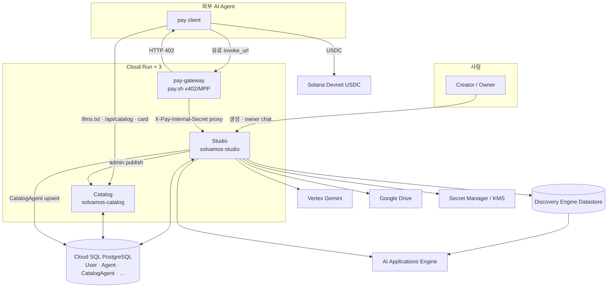
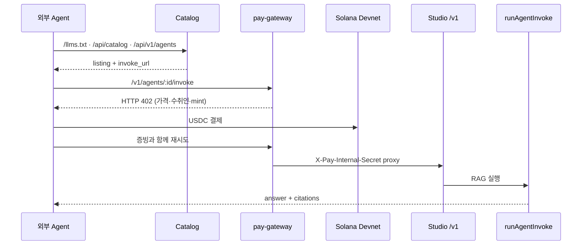

# SolVamos Studio

SolVamos는 지식을 **Vertex AI RAG 에이전트**로 만들고, **pay.sh(x402/MPP)** 로 호출당
USDC 결제를 붙여, Catalog에서 발견·호출할 수 있게 하는 agent commerce platform이다.

```bash
# 유료 에이전트 호출 — 가입·API 키·카드 등록 없음
pay fetch "https://<gateway>/v1/agents/<agentId>/invoke?prompt=우리 제품 반품 정책 알려줘"
```

| 구성요소 | 역할 | 위치 |
|---|---|---|
| **Studio** | 에이전트 빌더 · runtime · vault · 정산 | 이 repository |
| **Catalog** | 공개 marketplace · 기계용 discovery API | [`solvamos-catalog`](https://github.com/minvamos/solvamos-catalog) |
| **pay-gateway** | HTTP 402 결제 · Studio 내부 proxy | 이 repository (`pay/`, `Dockerfile.pay-gateway`) |

## 문서

- [제품 컨셉과 범위](./docs/CONCEPT.md)
- [전체 아키텍처](./docs/ARCHITECTURE.md)
- [핵심 프로세스와 운영 흐름](./docs/PROCESSES.md)
- [API surface](./docs/API.md)
- [Studio ↔ Catalog 통합](./docs/CATALOG_INTEGRATION.md)
- [A2A 정책](./docs/A2A.md)
- [pay.sh gateway local/devnet](./docs/PAYSH_LOCAL.md)
- [데이터베이스](./docs/DATABASE.md)

---

## 기능

- role / tone / security / custom policy 기반 agent builder
- agent별 Solana vault (Secret Manager / KMS)
- agent별 Discovery Engine Datastore + AI Applications Engine provisioning
- Google Drive, 로컬 문서/PDF, 공개 웹사이트 지식 ingest
- Engine Answer API grounded chat (citation, related questions, session)
- 첨부(이미지/PDF) · live Google Search
- 비용 인식 peer 호출: self → free peer → paid peer
- Catalog marketplace / JSON / Markdown / Agent Card discovery
- pay-gateway 전용 유료 public invoke (x402/MPP, Solana Devnet USDC)

---

## 아키텍처

SolVamos는 **Cloud Run 서비스 3개 + 공유 Cloud SQL 1개**로 동작한다.

**Studio가 만들고 → Catalog가 보여주고 → pay-gateway가 유료 호출을 결제·중계한다.**



### 서비스 경계

| 서비스 | 하는 일 | 하지 않는 일 |
|---|---|---|
| **Studio** | 로그인·tenant·에이전트 CRUD, Datastore/Engine, 지식 ingest, owner chat, peer orchestration, vault, 정산 ledger | 공개 marketplace UI (`/catalog`는 Catalog로 redirect) |
| **Catalog** | landing · marketplace · agent detail · JSON/Markdown/`llms.txt` | 결제 · RAG 실행 · Prisma migration 소유 |
| **pay-gateway** | 유료 `invoke_url`에 402를 걸고 USDC 수령 후 Studio `/v1`으로 proxy | 에이전트 로직·지식 |

연결 키: **`Agent.id == AgentOwnership.agentId == CatalogAgent.agentId`**.  
Studio가 runtime `Agent`를 만들고 같은 ID로 `CatalogAgent` listing을 남긴다. Catalog는 그
listing을 외부에 노출한다. Prisma migration은 Studio가 소유하고, Catalog는 배포 시
`prisma generate`만 수행한다.

### 데이터

```text
Cloud SQL (공유)
├─ User / Session          계정 · Google OAuth · 세션
├─ Tenant / TenantMember   workspace · 멤버십
├─ Agent                   prompt, fee, Datastore/Engine ID, vault pubkey
├─ AgentOwnership          관리 권한
├─ Wallet                  사용자 운영 지갑 (agent vault와 분리)
├─ CatalogAgent            공개 listing (Catalog source of truth)
├─ RagDocument             ingest 메타 · 추출 텍스트 mirror
└─ PaymentSettlement       결제 영수증

GCP / chain
├─ Discovery Engine Datastore   검색 지식 (Agent.vertexDataStoreId)
├─ AI Applications Engine       Answer API (Agent.vertexEngineId)
├─ Secret Manager [/ KMS]       vault private key
└─ Solana Devnet USDC           호출당 결제
```

### 에이전트 생성

`POST /api/agents/create` → provisioning (`server/provision.ts`, `server/vault.ts` 등):

1. prompt 컴파일 · agent Solana key → Secret Manager
2. `Agent` + `AgentOwnership` 저장
3. Datastore(+ Engine) 생성, Drive/로컬/웹 지식 import
4. `CatalogAgent` upsert (`server/catalog-db.ts`) + Catalog HTTP publish (`server/paysh-catalog.ts`)

```text
유료 invokeUrl  https://<pay-gateway>/v1/agents/{agentId}/invoke
무료 invokeUrl  https://<studio>/api/agents/{agentId}/invoke
```

유료 listing이 Studio origin을 가리키면 publish되지 않는다. 상업 결제는 gateway만 사용한다.

### 발견 → 결제 → 호출



Catalog discovery surface:

| Surface | URL |
|---|---|
| 마켓 가이드 | `GET /llms.txt` |
| 전체 목록 | `GET /api/catalog` |
| 슬림 인덱스 | `GET /api/v1/agents`, `/marketplace.json` |
| 에이전트 JSON | `GET /api/solvamos/:agentId` |
| Markdown card | `GET /api/solvamos/:agentId/index.md` |
| Agent Card | `GET <studio>/api/agents/:id/agent-card` |

Catalog의 `price`는 discovery 힌트다. 결제 금액·수취인·mint의 source of truth는 라이브
**HTTP 402 챌린지**다.

### 답변 runtime

공개/owner invoke는 `server/invoke-handler.ts`의 `runAgentInvoke`로 모인다.

```text
prompt
  ├─ 첨부 / 웹검색  → Datastore search + Vertex Gemini
  ├─ specialized    → AI Applications Answer API (fallback: search + Gemini)
  ├─ autonomous     → Vertex Gemini (+ Datastore retrieve)
  └─ peer 사용 시   → self → free Catalog peer → paid peer (vault USDC) → 합성
```

### 결제 경로

```text
유료 외부 호출  → pay-gateway /v1/agents/:id/invoke 만
                 (Studio /api/agents/:id/invoke 직접 호출 시 402 + gateway URL)
무료 외부 호출  → Studio /api/agents/:id/invoke
gateway → Studio → /v1/agents/:id/invoke + X-Pay-Internal-Secret
```

- gateway 계약: `pay/solvamos-provider.devnet.yml`
- 검증·replay 방지: `server/payment.ts`
- 정산: `server/gateway-settle.ts` → `PaymentSettlement`
- 사용자 `Wallet` ≠ agent vault (`Agent.publicKey` + Secret Manager)

공개 커머스 실행 경로는 `invoke_url` + 402가 유일하다. Google A2A는 디스커버리용 Agent Card
형태만 사용한다. 상세: [`docs/A2A.md`](./docs/A2A.md).

---

## 기술 스택

| 레이어 | 기술 |
|---|---|
| AI / RAG | Discovery Engine Datastore · AI Applications Engine · Vertex Gemini |
| Payments | pay.sh · x402/MPP · Solana Devnet USDC |
| Backend | Node.js 20 · Express · TypeScript · Prisma |
| Frontend | React 19 · Vite · Tailwind CSS 4 · Motion |
| Data | Cloud SQL PostgreSQL |
| Cloud | Cloud Run ×3 · Artifact Registry · Cloud Build · Secret Manager / KMS |
| Identity | Google OAuth 2.0 · Drive `drive.readonly` |

---

## 설치 및 로컬 구동

### 필수

- Node.js 20+
- GCP project (Discovery Engine · Vertex AI) · Google OAuth Web Client
- pay.sh CLI (`npm run pay:install`) · Devnet USDC 지갑

### Studio + gateway

```bash
git clone https://github.com/minvamos/solvamos-studio.git
cd solvamos-studio
npm install
cp .env.example .env
npm run dev                 # http://localhost:3000
```

로컬에서는 `PAY_GATEWAY_MANAGED=true`(기본)로 Studio가 pay.sh gateway를 `:1402`에 띄운다.

```bash
PAY_INTERNAL_SECRET=dev-pay-internal \
  pay server start pay/solvamos-provider.devnet.yml --bind 127.0.0.1:1402
```

### Catalog

```bash
git clone https://github.com/minvamos/solvamos-catalog.git
cd solvamos-catalog && cp .env.example .env
npm install && npm run dev   # http://127.0.0.1:4173
```

### 유료 호출 확인

```bash
curl -i "http://127.0.0.1:1402/v1/agents/<agentId>/invoke?prompt=hello"   # → 402
pay fetch "http://127.0.0.1:1402/v1/agents/<agentId>/invoke?prompt=hello" # → 결제 + 답변
```

### Cloud Run

```bash
gcloud builds submit --config cloudbuild.studio.yaml .
gcloud builds submit --config cloudbuild.pay-gateway.yaml .
# Catalog는 solvamos-catalog repository에서 배포
```

환경 변수와 배포 순서: [PROCESSES.md](./docs/PROCESSES.md#11-배포).

---

## Repository 구조

```text
solvamos-studio/                 Studio + pay-gateway
  server.ts                      Express 엔트리
  server/
    provision.ts · vault.ts      생성 · Solana key · Secret Manager
    drive-ingest.ts · local-ingest.ts
    rag.ts · vertex-*.ts         Answer API / Gemini / Datastore search
    invoke-handler.ts            runAgentInvoke
    a2a.ts                       peer orchestration
    catalog-db.ts                CatalogAgent upsert
    paysh-catalog.ts             Catalog HTTP publish
    payment.ts · gateway-settle.ts
    pay-gateway-manager.ts       로컬 pay.sh (:1402)
    agent-card.ts
  pay/solvamos-provider*.yml
  prisma/schema.prisma
  src/pages/
  Dockerfile
  Dockerfile.pay-gateway

solvamos-catalog/                공개 discovery (별도 repository)
  server/catalog.ts
  server/catalog-db-store.ts
  server/llm-discovery.ts        /llms.txt · settlement guide
  src/pages/                     Landing · Marketplace · Agent detail
```

---

## 현재 상태

- 결제는 **Solana Devnet**만 사용한다.
- 에이전트별 fee는 Studio/Catalog에서 가변이나, provider YAML 미터링은 현재 고정
  (`$0.001/req`)이다.
- gateway receipt → `PaymentSettlement` 연결은 부분 구현이다 (온체인 스캔 보완).
- tenancy는 shared GCP project + ownership 논리 격리(Lab)가 기본이다.

상세: [ROADMAP.md](./docs/ROADMAP.md) · [PLATFORM_AUDIT.md](./docs/PLATFORM_AUDIT.md).

## 라이선스

MIT License.
