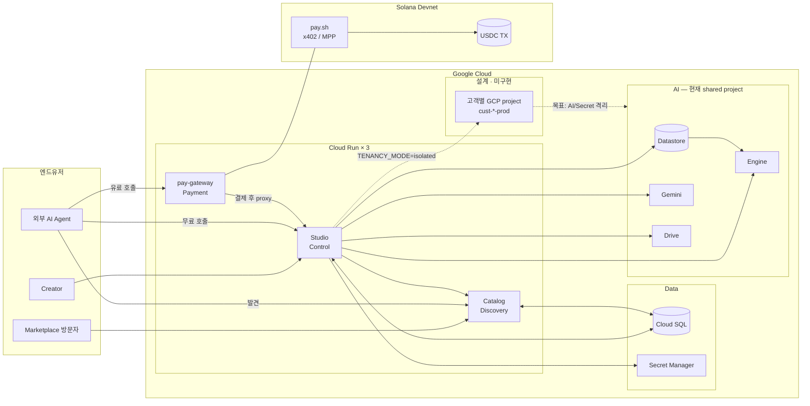
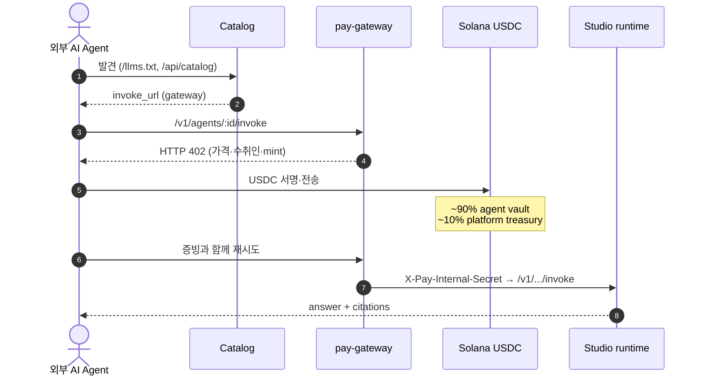

# SolVamos Studio

SolVamos는 지식을 **Vertex AI RAG 에이전트**로 만들고, **pay.sh(x402/MPP)** 로 호출당
USDC 결제를 붙여, Catalog에서 발견·호출할 수 있게 하는 agent commerce platform이다.

```bash
# 유료 에이전트 호출 — 가입·API 키·카드 등록 없음
pay fetch "https://<gateway>/v1/agents/<agentId>/invoke?prompt=우리 제품 반품 정책 알려줘"
```

| 구성요소 | 역할 | 위치 |
|---|---|---|
| **Studio** | 에이전트 빌더 · runtime · vault · 정산 | 이 repository |
| **Catalog** | 공개 marketplace · 기계용 discovery API | [`solvamos-catalog`](https://github.com/minvamos/solvamos-catalog) |
| **pay-gateway** | HTTP 402 결제 · Studio 내부 proxy | 이 repository (`pay/`, `Dockerfile.pay-gateway`) |

## 문서

- [제품 컨셉과 범위](./docs/CONCEPT.md)
- [전체 아키텍처](./docs/ARCHITECTURE.md)
- [슬라이드용 상세 동작도](./docs/ARCHITECTURE_SLIDES.md) — CRUD · 결제 · A2A · RAG · vault
- [핵심 프로세스와 운영 흐름](./docs/PROCESSES.md)
- [API surface](./docs/API.md)
- [Studio ↔ Catalog 통합](./docs/CATALOG_INTEGRATION.md)
- [A2A 정책](./docs/A2A.md)
- [pay.sh gateway local/devnet](./docs/PAYSH_LOCAL.md)
- [데이터베이스](./docs/DATABASE.md)

---

## 기능

- role / tone / security / custom policy 기반 agent builder
- agent별 Solana vault (Secret Manager / KMS)
- agent별 Discovery Engine Datastore + AI Applications Engine provisioning
- Google Drive, 로컬 문서/PDF, 공개 웹사이트 지식 ingest
- Engine Answer API grounded chat (citation, related questions, session)
- 첨부(이미지/PDF) · live Google Search
- 비용 인식 peer 호출: self → free peer → paid peer
- Catalog marketplace / JSON / Markdown / Agent Card discovery
- pay-gateway 전용 유료 public invoke (x402/MPP, Solana Devnet USDC)

---

## 아키텍처

한 줄: **Studio가 만들고 → Catalog가 보여주고 → pay-gateway가 유료 호출을 결제·중계한다.**

역할을 네 덩어리로 보면 된다.

| 레이어 | 누가 | 하는 일 |
|---|---|---|
| **Control** | Studio | 로그인, 에이전트 생성, 지식 ingest, owner chat, runtime, vault |
| **Discovery** | Catalog | marketplace / JSON / `llms.txt` — 무엇을 팔는지 공개 |
| **Payment** | pay-gateway + Solana | HTTP 402, USDC 정산, 결제 후 Studio proxy |
| **AI / Data** | Vertex · Cloud SQL · Secret Manager | 지식 검색·답변, listing/계정 DB, vault key |

### 1) 전체 그림 (GCP 안)

실선 = 현재 Lab 구현. 점선 = 설계 목표(테넌트별 GCP project, 코드에 스켈레톤만·기본 비활성).



**읽는 순서:** 왼쪽 유저 → 가운데 Cloud Run 3역할 → 오른쪽 아래 체인.  
Catalog는 Gateway를 직접 호출하지 않고 `invoke_url`만 알려준다. 유료 HTTP는 Agent → Gateway.

### 2) 유료 호출만 따로 (결제 레일)



```text
유료  https://<gateway>/v1/agents/{id}/invoke
무료  https://<studio>/api/agents/{id}/invoke
Gateway → Studio   /v1/... + X-Pay-Internal-Secret
Studio → Catalog   POST /api/catalog/agents + X-Catalog-Admin-Secret
```

- 402 챌린지가 결제 source of truth (Catalog `price`는 힌트)
- 유료를 Studio origin에 직접 치면 실행하지 않고 402 + gateway URL만 반환
- 체인 쪽: buyer wallet 서명 · agent vault 수취 · treasury split · (devnet) fee_payer / operator ATA
- 코드: `pay/*.yml`, `payment.ts`, `gateway-settle.ts`, `pay-payer.ts`

### 3) 테넌시 — 지금 vs 목표

| | 지금 (Lab · 구현됨) | 목표 (설계 · 미구현) |
|---|---|---|
| GCP project | 플랫폼 하나 (`GOOGLE_CLOUD_PROJECT`) | 고객별 `cust-*-prod` |
| 격리 | Cloud SQL ownership / tenant 멤버십 | project 단위 AI·Secret 격리 |
| AI 리소스 | 같은 project 안 **agent별** Datastore/Engine | 테넌트 project 안 Datastore/Engine |
| 스위치 | `TENANCY_MODE=shared` (기본) | `isolated` + `ENABLE_ORG_PROJECT_CREATE` (기본 false) |

### 서비스 경계 · 데이터

| 서비스 | 하는 일 | 하지 않는 일 |
|---|---|---|
| **Studio** | CRUD, Datastore/Engine, ingest, owner chat, peer orchestration, vault, 정산 | 공개 marketplace UI |
| **Catalog** | landing · marketplace · JSON/Markdown/`llms.txt` | 결제 · RAG · migration 소유 |
| **pay-gateway** | 402 · USDC · Studio `/v1` proxy | 에이전트 로직·지식 |

연결 키: `Agent.id == AgentOwnership.agentId == CatalogAgent.agentId`.  
Prisma migration은 Studio 소유. Catalog는 `prisma generate`만.

```text
Cloud SQL     User · Tenant · Agent · CatalogAgent · Wallet · PaymentSettlement …
GCP AI        Datastore · Engine · Gemini · Drive
Secrets       agent vault private key (Secret Manager / KMS)
Chain         buyer wallet · agent vault · platform treasury · USDC
```

### 생성 · runtime · discovery (요약)

**생성** `POST /api/agents/create` → vault(SM) → Datastore/Engine → `CatalogAgent` upsert + Catalog publish.

**Runtime** `runAgentInvoke`: specialized=Engine Answer · autonomous/첨부/웹=Gemini(+Datastore) · peer=Catalog 후보를 같은 결제 레일로 재호출.

**Discovery**

| Surface | URL |
|---|---|
| 가이드 | `GET /llms.txt` |
| 목록 | `GET /api/catalog`, `/api/v1/agents` |
| 상세 | `GET /api/solvamos/:id`, `.../index.md` |
| Agent Card | `GET <studio>/api/agents/:id/agent-card` |

공개 실행 경로는 `invoke_url` + 402가 유일하다. A2A는 Card 형태만. [`docs/A2A.md`](./docs/A2A.md) · 상세 [`docs/ARCHITECTURE.md`](./docs/ARCHITECTURE.md).

---

## 기술 스택

| 레이어 | 기술 |
|---|---|
| AI / RAG | Discovery Engine Datastore · AI Applications Engine · Vertex Gemini |
| Payments | pay.sh · x402/MPP · Solana Devnet USDC |
| Backend | Node.js 20 · Express · TypeScript · Prisma |
| Frontend | React 19 · Vite · Tailwind CSS 4 · Motion |
| Data | Cloud SQL PostgreSQL |
| Cloud | Cloud Run ×3 · Artifact Registry · Cloud Build · Secret Manager / KMS |
| Identity | Google OAuth 2.0 · Drive `drive.readonly` |

---

## 설치 및 로컬 구동

### 필수

- Node.js 20+
- GCP project (Discovery Engine · Vertex AI) · Google OAuth Web Client
- pay.sh CLI (`npm run pay:install`) · Devnet USDC 지갑

### Studio + gateway

```bash
git clone https://github.com/minvamos/solvamos-studio.git
cd solvamos-studio
npm install
cp .env.example .env
npm run dev                 # http://localhost:3000
```

로컬에서는 `PAY_GATEWAY_MANAGED=true`(기본)로 Studio가 pay.sh gateway를 `:1402`에 띄운다.

```bash
PAY_INTERNAL_SECRET=dev-pay-internal \
  pay server start pay/solvamos-provider.devnet.yml --bind 127.0.0.1:1402
```

### Catalog

```bash
git clone https://github.com/minvamos/solvamos-catalog.git
cd solvamos-catalog && cp .env.example .env
npm install && npm run dev   # http://127.0.0.1:4173
```

### 유료 호출 확인

```bash
curl -i "http://127.0.0.1:1402/v1/agents/<agentId>/invoke?prompt=hello"   # → 402
pay fetch "http://127.0.0.1:1402/v1/agents/<agentId>/invoke?prompt=hello" # → 결제 + 답변
```

### Cloud Run

```bash
gcloud builds submit --config cloudbuild.studio.yaml .
gcloud builds submit --config cloudbuild.pay-gateway.yaml .
# Catalog는 solvamos-catalog repository에서 배포
```

환경 변수와 배포 순서: [PROCESSES.md](./docs/PROCESSES.md#11-배포).

---

## Repository 구조

```text
solvamos-studio/                 Studio + pay-gateway
  server.ts                      Express 엔트리
  server/
    provision.ts · vault.ts      생성 · Solana key · Secret Manager
    drive-ingest.ts · local-ingest.ts
    rag.ts · vertex-*.ts         Answer API / Gemini / Datastore search
    invoke-handler.ts            runAgentInvoke
    a2a.ts                       peer orchestration
    catalog-db.ts                CatalogAgent upsert
    paysh-catalog.ts             Catalog HTTP publish
    payment.ts · gateway-settle.ts
    pay-gateway-manager.ts       로컬 pay.sh (:1402)
    agent-card.ts
  pay/solvamos-provider*.yml
  prisma/schema.prisma
  src/pages/
  Dockerfile
  Dockerfile.pay-gateway

solvamos-catalog/                공개 discovery (별도 repository)
  server/catalog.ts
  server/catalog-db-store.ts
  server/llm-discovery.ts        /llms.txt · settlement guide
  src/pages/                     Landing · Marketplace · Agent detail
```

---

## 현재 상태

- 결제는 **Solana Devnet**만 사용한다.
- 에이전트별 fee는 Studio/Catalog에서 가변이나, provider YAML 미터링은 현재 고정
  (`$0.001/req`)이다.
- gateway receipt → `PaymentSettlement` 연결은 부분 구현이다 (온체인 스캔 보완).
- tenancy는 shared GCP project + ownership 논리 격리(Lab)가 기본이다.

상세: [ROADMAP.md](./docs/ROADMAP.md) · [PLATFORM_AUDIT.md](./docs/PLATFORM_AUDIT.md).

## 라이선스

MIT License.
