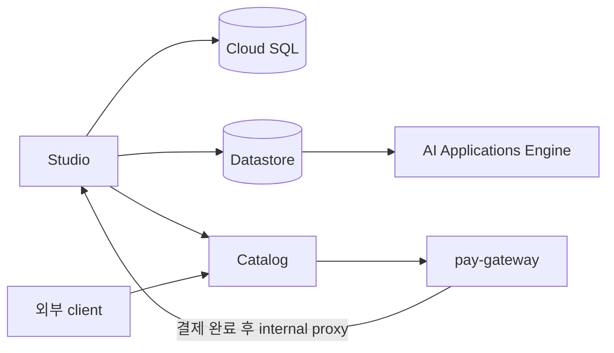

# SolVamos Studio

SolVamos Studio는 사용자의 지식을 **Discovery Engine Datastore**에 넣고, **AI Applications Engine** 기반 에이전트로 만든 뒤, Catalog에서 발견하고 무료 또는 x402/MPP USDC 결제로 호출하게 하는 agent commerce platform이다.

현재 기본 운영 모델은 하나의 GCP project와 Cloud SQL을 공유하면서 tenant/ownership으로 논리 격리하는 Lab 구성이다. 고객별 isolated GCP project는 목표 방향이지만 production 완료 상태가 아니다.

## 문서

- [제품 컨셉과 범위](./docs/CONCEPT.md)
- [전체 아키텍처](./docs/ARCHITECTURE.md)
- [핵심 프로세스와 운영 흐름](./docs/PROCESSES.md)
- [현재 상태와 Roadmap](./docs/ROADMAP.md)
- [API surface](./docs/API.md)
- [Studio ↔ Catalog 통합](./docs/CATALOG_INTEGRATION.md)
- [데이터베이스](./docs/DATABASE.md)
- [pay.sh gateway local/devnet](./docs/PAYSH_LOCAL.md)

---

## 핵심 기능

- 역할/tone/security/custom policy 기반 agent builder
- agent별 Solana vault와 Secret Manager/KMS 저장
- agent별 Datastore + Engine provisioning
- Google Drive, 로컬 문서/PDF, 공개 웹사이트 지식
- 웹사이트 `PUBLIC_WEBSITE` + `hostname/*` crawl
- Engine Answer API 기반 grounded text chat
- 대화 history/session, citation, related questions
- 사진/PDF/text turn attachment와 live Google Search
- 비용 인식 A2A: self → free peer → paid peer
- shared Cloud SQL의 사용자/tenant/ownership/listing
- 별도 Catalog marketplace와 JSON/Markdown/A2A discovery
- pay-gateway 전용 유료 public invoke

---

## 기술 스택

- Frontend: React 19, Vite, Tailwind CSS 4, Motion
- Backend: Express, Node.js, TypeScript
- AI: Discovery Engine Datastore/AI Applications Engine, Vertex Gemini, `@google/genai`
- Database: PostgreSQL/Cloud SQL, Prisma
- Payments: pay.sh-compatible x402/MPP gateway, Solana Devnet USDC
- Cloud: Cloud Run, Artifact Registry, Secret Manager, Cloud KMS
- Google: OAuth 2.0, Drive `drive.readonly`

---

## 설치 및 로컬 구동

### 필수
- **Node.js 20+** (권장; Dockerfile도 20)
- npm

### 1. 클론 · 설치
```bash
git clone https://github.com/minvamos/solvamos-studio.git
# Lab fork: https://github.com/mikohatsu/solvamos-studio.git
cd solvamos-studio
npm install
```

### 2. 환경 변수
```bash
cp .env.example .env
```

로컬 Lab 최소 예시:

```env
GEMINI_API_KEY=
APP_URL=http://localhost:3000
PORT=3000
NODE_ENV=development

# Google SSO + Drive (필수에 가깝음 — 로그인/Drive 브라우저)
GOOGLE_CLIENT_ID=
GOOGLE_CLIENT_SECRET=
OAUTH_REDIRECT_URI=http://localhost:3000/api/auth/google/callback
ALLOW_ADC_DRIVE=false

GOOGLE_CLOUD_PROJECT=
DATABASE_URL=postgresql://...
TENANCY_MODE=shared
ALLOW_LOCAL_VAULT_FALLBACK=true
ALLOW_PAYMENT_BYPASS=true
PAYMENT_NETWORK=localnet
USE_PAY_GATEWAY=true
PAY_GATEWAY_URL=http://127.0.0.1:1402
PAY_INTERNAL_SECRET=dev-pay-internal
PLATFORM_TREASURY_PUBKEY=AoUNKE8uQ8y1FEtU6YSFCsopK9veP6jZ6EGNoULjdwva
```

OAuth Web Client에 localhost origin/redirect를 등록해야 한다.

플랫폼 메타데이터는 PostgreSQL에 저장한다. `.data/`는 로컬 corpus, replay cache 등 개발/중간 artifact에 사용된다.

### 3. 개발 서버
```bash
npm run dev
```
브라우저: [http://localhost:3000](http://localhost:3000)

```bash
npm run lint    # tsc --noEmit
npm run smoke   # 서버 기동 중일 때 /api/status 등 스모크
```

### 4. 로컬 프로덕션 빌드
```bash
npm run build   # Vite + esbuild → dist/
npm start       # NODE_ENV=production 권장; PORT 기본 3000 (Cloud Run은 8080)
```

### 5. Cloud Run 이미지

```bash
gcloud builds submit --config cloudbuild.studio.yaml .
gcloud builds submit --config cloudbuild.pay-gateway.yaml .
```

Studio와 gateway는 별도 Cloud Run 서비스로 배포한다. Catalog도 `solvamos-catalog` repo에서 별도 배포한다. 필수 환경 변수와 배포 순서는 [PROCESSES.md](./docs/PROCESSES.md#11-배포)를 참고한다.

---

## 아키텍처 요약



- 지식: Datastore
- grounded text answer: AI Applications Engine
- 첨부/live web: Datastore search + Vertex Gemini
- discovery: Catalog
- 유료 상업 호출: pay-gateway
- runtime/소유자 테스트: Studio

전체 내용은 [ARCHITECTURE.md](./docs/ARCHITECTURE.md)를 참고한다.

---

## 라이선스

This project is licensed under the MIT License.
