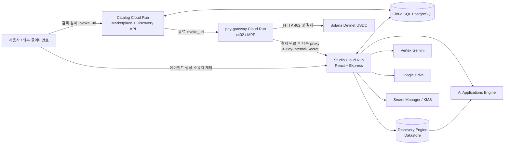
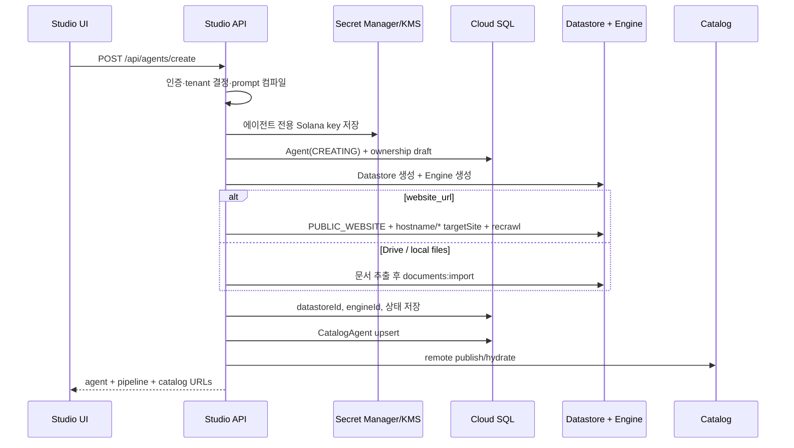
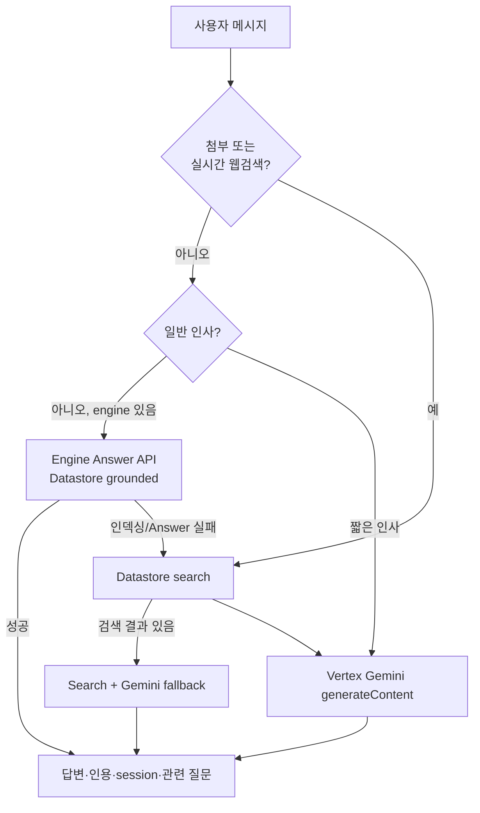
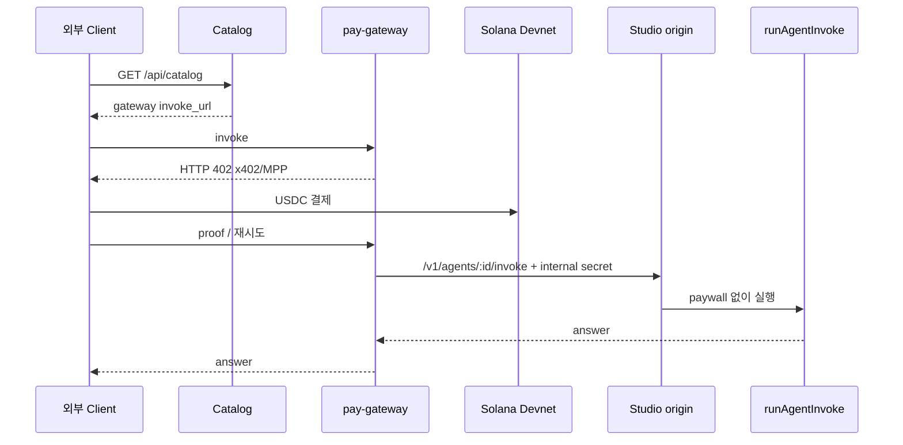

# SolVamos 전체 아키텍처

> 기준: 2026-07-25 현재 `solvamos-studio` 및 `solvamos-catalog` 코드  
> 이 문서는 목표 상태가 아니라 **현재 구현**, **부분 구현**, **후속 과제**를 구분해 설명한다.

## 1. 시스템 목적

SolVamos는 사용자가 도메인 지식과 정책을 가진 AI 에이전트를 만들고, 공개 Catalog에서 발견하며, 무료 또는 USDC 사용량 결제로 호출할 수 있게 하는 플랫폼이다.

핵심 경계는 다음과 같다.

- **Studio**: 사용자·테넌트·에이전트·지식·대화·peer orchestration을 관리하는 control/runtime plane
- **Catalog**: 공개 discovery surface. `CatalogAgent`를 읽어 marketplace와 API로 노출
- **pay-gateway**: 유료 호출의 유일한 상업 결제 진입점
- **Cloud SQL PostgreSQL**: 플랫폼 메타데이터와 공개 listing의 영속 저장소
- **Discovery Engine Datastore**: 에이전트 지식의 원본 검색 인덱스
- **AI Applications Engine**: Datastore 위에서 grounded Answer API를 제공하는 앱 (`runtimeMode=specialized`)
- **Vertex Gemini**: 자율모드(`runtimeMode=autonomous`) 기본 응답기 + 첨부·웹검색·Data Store retrieve RAG · 특화모드 fallback
- **Secret Manager/KMS**: 에이전트별 Solana vault private key 보관

## 2. 배포 토폴로지

운영 서비스는 독립 Cloud Run 이미지다.

- Studio: `Dockerfile`, `cloudbuild.studio.yaml`
- Catalog: `solvamos-catalog/Dockerfile`, `solvamos-catalog/cloudbuild.yaml`
- gateway: `Dockerfile.pay-gateway`, `cloudbuild.pay-gateway.yaml`

Cloud Build 파일은 이미지를 빌드·push한다. 실제 Cloud Run 배포 설정과 환경 변수/Secret 연결은 CI 또는 `gcloud run deploy` 단계가 담당한다.

## 3. 데이터 및 책임 경계

### 3.1 Cloud SQL

Studio Prisma schema가 migration 소유자다. Catalog는 동일 DB의 `CatalogAgent` 모델만 선언하고 migration은 만들지 않는다.

주요 모델:

- `User`, `Session`: 계정, Google 연동 토큰, 회전 가능한 로그인 세션
- `Tenant`, `TenantMember`: workspace와 멤버십
- `Agent`, `AgentOwnership`: runtime 에이전트와 사용자 소유권
- `Wallet`: 사용자 운영 지갑. 에이전트 vault와 분리
- `CatalogAgent`: 공개 discovery용 denormalized listing
- `RagDocument`: Drive/로컬 ingest 문서 메타와 추출 텍스트 mirror
- `PaymentSettlement`: 결제 영수증 표시용 모델

`Agent.id == AgentOwnership.agentId == CatalogAgent.agentId`가 논리적 연결 키다.

### 3.2 지식 저장소

에이전트의 검색 지식은 **Discovery Engine Datastore**에 있다. `Agent.vertexDataStoreId`가 연결을 보존한다.

- 문서/Drive 업로드: `CONTENT_REQUIRED`
- 공개 웹사이트: `PUBLIC_WEBSITE`
- 구조화 빈 저장소: `NO_CONTENT`
- 미디어 타입: `MEDIA` vertical

로컬 JSON corpus와 `RagDocument`는 ingest 및 장애 시 fallback/mirror다. 운영 지식의 최종 검색 대상은 Datastore다.

### 3.3 앱/Engine과 runtimeMode

`Agent.runtimeMode`가 응답 경로를 나눈다.

- **specialized** (기본): `vertexEngineId` + Datastore. Engine Answer API가 우선 (`promptSpec.preamble` = systemPrompt)
- **autonomous**: Datastore만 생성·적재. Engine 없음. 매 턴 Vertex Gemini + 필요 시 Datastore `:search` 스니펫 주입
- `customInstructions`는 프리셋(role/tone/security) 컴파일 결과에 append되어 양쪽 모드의 동일 systemPrompt로 쓰인다

`Agent.vertexEngineId`는 specialized에서 Datastore를 쓰는 AI Applications Engine을 가리킨다.

- Search Engine은 `SEARCH_ADD_ON_LLM`으로 생성
- Engine Answer API: `engines/{engineId}/servingConfigs/default_search:answer`
- specialized에서 Engine이 없으면 재프로비저닝 안내; autonomous에서는 Engine 없음을 정상으로 본다

Datastore는 지식이고 Engine은 그 지식을 Answer API로 제공하는 앱이다. 둘은 같은 리소스가 아니다.

## 4. 에이전트 생성

구현 순서:

1. 로그인 사용자와 공유 Lab tenant를 확인한다.
2. 사용자 지갑과 별개인 에이전트 Solana keypair를 생성한다.
3. private key를 Secret Manager에 저장하고, 설정 시 KMS CMEK로 암호화한다.
4. `Agent`를 `CREATING` 상태로 먼저 저장한다.
5. 데이터 소스에 맞는 Datastore와 Engine을 만든다.
6. Drive 또는 로컬 파일은 추출·mirror 후 Datastore에 import한다.
7. 웹 URL은 앱 유형을 강제로 `website`로 바꾸고 `PUBLIC_WEBSITE` Datastore에 `hostname/*`를 등록한 뒤 recrawl을 요청한다.
8. 최종 `Agent`/ownership/`CatalogAgent`를 저장하고 Catalog service에 publish한다.

실패 시 생성 중인 `Agent`는 삭제하고 listing은 unlist한다. Secret Manager에 이미 생성된 secret version의 보상 삭제는 현재 구현되어 있지 않다.

## 5. 대화 및 생성 경로

### 5.1 텍스트 RAG

specialized 기본 텍스트 질문은 Engine Answer API를 우선한다. autonomous는 Engine을 건너뛰고 Gemini(+retrieve)만 사용한다.

- citation 포함
- 한국어 답변
- jailbreak/adversarial filter
- related questions
- Engine session
- corpus image/figure 반환을 요청하는 `multimodalSpec`

클라이언트는 에이전트별 Answer session resource name을 메모리에 보관하고 다음 turn에 다시 보낸다. 첫 turn에는 최근 대화를 query에 포함해 연속성을 보완한다.

### 5.2 사진·파일 첨부

대화 첨부는 생성용 지식 업로드와 별도 기능이다.

- UI가 이미지/PDF/text를 base64로 전송
- 서버가 크기·개수를 제한하고 MIME을 정규화
- Datastore 검색 결과를 context로 얻은 뒤 Vertex Gemini `inlineData` parts와 함께 생성
- 현재 첨부 파일은 turn 분석용이며 자동으로 에이전트 Datastore에 영구 적재되지 않는다

### 5.3 실시간 웹검색

웹검색 토글은 Vertex Gemini의 `googleSearch` tool을 사용한다. 이 기능은 웹사이트 Datastore crawl과 다르다.

- **웹사이트 Datastore**: 사전에 등록·crawl된 소유 지식
- **Google Search grounding**: 현재 웹을 turn 단위로 조회하는 외부 지식

첨부 또는 웹검색 turn은 Engine `:answer`가 아니라 Datastore `:search` + Vertex Gemini 경로다.

### 5.4 fallback

Engine Answer가 실패했지만 Datastore 검색 결과가 있으면 search + Gemini로 답한다. Engine도 Datastore 결과도 없으면 설정/인덱싱 상태를 명확히 반환한다. 일반 인사는 retrieval을 생략할 수 있다.

## 6. 결제 경로

유료 외부 호출의 정식 경로는 하나다.

정책:

- 유료 `CatalogAgent.invokeUrl`은 pay-gateway URL이어야 한다.
- 유료 외부 요청이 Studio `/api/agents/:id/invoke`를 직접 호출하면 402와 gateway URL만 반환한다.
- Studio origin의 legacy `X-PAYMENT-PROOF` 정산 경로는 사용하지 않는다.
- gateway가 호출하는 `/v1/agents/:agentId/invoke`는 `X-Pay-Internal-Secret`으로 보호한다.
- Studio 소유자 테스트는 ownership/tenant membership을 확인한 뒤 paywall을 생략한다.
- 무료 에이전트는 Studio origin을 직접 호출할 수 있다.

현재 중요한 제한:

1. provider YAML은 요청당 `0.001` USD로 고정되어 있으나 에이전트 fee UI/DB는 가변이다. 동적 요금 계약이 필요하다.
2. gateway 결제 완료 결과를 Studio `PaymentSettlement`에 기록하는 callback/event가 없다. 현재 settlement 모델/UI는 있지만 gateway-only 상업 호출의 영수증 source와 완전히 연결되지 않았다.
3. `server/payment.ts`의 on-chain verifier와 legacy mock verifier는 A2A Lab fallback을 위해 남아 있으며 public 상업 경로의 권위 있는 verifier가 아니다.

## 7. Catalog와 discovery

`CatalogAgent` 테이블이 listing 데이터의 영속 source of truth이며, Catalog service가 공개 discovery의 권위 있는 surface다.

Studio:

- 에이전트 create/update/delete 시 `CatalogAgent`를 upsert/unlist
- Catalog API에도 admin secret으로 publish
- 원격 Catalog를 짧게 캐시하여 A2A 후보를 만든다

Catalog:

- marketplace `/marketplace`
- agent detail `/a/:agentId`
- JSON `/api/catalog`, `/api/solvamos/:agentId`
- Markdown card `/api/solvamos/:agentId/index.md`
- Studio write API `/api/catalog/agents`
- DB 미설정 local mode에서만 file store fallback

유료 listing은 gateway invoke URL을, 무료 listing은 Studio origin invoke URL을 노출한다.

## 8. Peer orchestration (제품 내부 “A2A”)

> Google A2A Protocol JSON-RPC / `@a2a-js/sdk`는 **사용하지 않는다**.  
> 공개 실행은 `invoke_url`만. 정책: [`docs/A2A.md`](./A2A.md).

Studio peer orchestration(`server/a2a.ts`)은 Catalog peer를 고르는 **내부 기능**이다. 켜면 비용 인식 순서로 실행한다.

1. 자기 Datastore/Engine으로 먼저 답한다.
2. 답이 약하면 fee 0인 Catalog peer를 계획·호출한다.
3. 여전히 부족할 때만 유료 peer를 선택한다.
4. 유료 peer는 vault 결제 후 origin/gateway invoke로 호출한다 (공개 커머스와 동일 정산 레일).
5. 성공한 peer 정보만 자기 답변과 합성한다.
6. 결제·peer 장애는 사용자 답변 전체를 실패시키지 않고 self best-effort로 복구한다.

Discovery용 Agent Card는 `GET /api/agents/:id/agent-card`에 두고, `extensions.solvamos.pay.invokeUrl`로 실행 URL을 가리킨다.

현재 peer planner와 품질 판단은 heuristic + Gemini 기반이며, 예산 상한·사용자 승인·분산 tracing은 아직 없다.

## 9. 인증, tenancy, vault

인증:

- email/password 가입·로그인
- Google OAuth login/signup/link
- HttpOnly auth/refresh cookie와 DB `Session`
- Google Drive OAuth token은 server-side session에 보관

현재 Lab tenancy:

- 모든 사용자를 하나의 `GOOGLE_CLOUD_PROJECT`에 매핑하는 shared tenant
- 사용자별 `TenantMember`와 `AgentOwnership`으로 논리 분리
- isolated customer project 생성용 config와 일부 tenant API는 있으나 기본적으로 비활성

vault:

- 사용자 wallet은 운영/표시용
- 에이전트마다 별도 Solana keypair
- private key는 Secret Manager, 선택적으로 KMS CMEK
- local fallback은 개발 전용이며 production safety check가 금지

## 10. 프론트엔드 구조

- `App.tsx`: 인증 bootstrap과 대부분의 application state/API orchestration
- `AppShell.tsx`: top-level navigation
- `StudioPage.tsx`: agent builder + owner test chat
- `AgentsPage.tsx`: 보유 에이전트 관리
- `SettlementsPage.tsx`: 영수증 목록
- `DevAgentLabPage.tsx`: RAG mode, citation, Engine/session/tool trace 확인
- `WalletModal.tsx`: Phantom/manual wallet 연결
- `appRoute.ts`: history 기반 lightweight route mapping

공개 marketplace는 Studio 내부에 중복 구현하지 않고 Catalog `/marketplace`로 이동한다.

## 11. 관측성과 상태

현재 제공:

- `/healthz`, `/readyz`, `/api/status`, `/v1/health`
- 생성 pipeline 응답
- `ragMode`, generation backend, engine/dataStore ID, tools used
- Dev Agent Lab raw trace
- 서버 console log

부족:

- request/correlation ID
- 구조화 로그와 Cloud Trace
- gateway → Studio 결제 receipt correlation
- Engine crawl/index 상태 polling
- A2A hop별 latency/token/cost
- SLO와 alert

## 12. 신뢰 수준 표기

- **구현됨**: 코드와 빌드가 존재하고 경로가 연결됨
- **부분 구현**: 모델/UI 또는 fallback은 있으나 운영 이벤트 source가 연결되지 않음
- **계획**: config/스켈레톤만 있거나 production safety가 검증되지 않음

세부 우선순위는 [ROADMAP.md](./ROADMAP.md), 사용자·운영 프로세스는 [PROCESSES.md](./PROCESSES.md)를 따른다.  
2026-07-25 코드베이스 감사(Critical/High 목록·결제 경로 판정)는 [PLATFORM_AUDIT.md](./PLATFORM_AUDIT.md)를 본다.

## 13. 현재 코드에서 확인된 구조적 주의사항

### Authorization

- `GET /api/agents`는 비로그인 시 빈 목록을 반환해야 한다(전체 Agent fallback 금지). Critical 패치 이후 정책은 소유권 스코프.
- tenant/agent mutation은 owner/admin 또는 `userCanManageAgent`를 요구한다. 상세 갭·이력은 [PLATFORM_AUDIT.md](./PLATFORM_AUDIT.md).
- `requireGoogleSession`이라는 이름의 middleware는 실제로는 일반 로그인만 요구하고, Drive token은 ingest 시점에 별도 확인한다.

### Shared Datastore Lab flag

`VERTEX_SHARED_DATA_STORE=true`와 `VERTEX_DATA_STORE_ID`를 설정하면 기존 store를 반환하는 경로가 Engine을 보장하지 않는다. 현재 architecture의 1 Agent : 1 Datastore/Engine 원칙을 검증하려면 이 flag를 production에서 사용하지 않거나 Engine reconciliation을 추가해야 한다.

### Ephemeral artifacts

production `/tmp/solvamos-data`에 남는 local corpus, OAuth file cache, payment replay cache는 Cloud Run instance lifecycle을 넘는 영속 source가 아니다. DB/Datastore가 권위 있는 저장소여야 하며, replay/idempotency는 DB 또는 외부 durable store로 옮겨야 한다.

### Frontend state

- chat history와 Engine session은 browser memory에만 있어 refresh 시 사라진다.
- Studio owner chat은 첨부·웹검색·session을 지원하지만 Dev Agent Lab은 아직 같은 기능을 모두 지원하지 않는다.
- `App.tsx`와 `StudioPage.tsx`에 orchestration/UI 책임이 집중되어 있다.
- 기존 `PublicCatalogPage`는 route에 연결되지 않은 orphan이며 공개 marketplace는 외부 Catalog로 redirect된다.

### Catalog drift

- DB 직접 upsert와 Catalog HTTP publish가 병행되는 이중 write다.
- 일부 UI와 CI 설정에 canonical Catalog URL/env binding drift 가능성이 있다.
- runtime status의 Catalog remote 설정 표시는 실제 config와 일치하도록 정리해야 한다.

### Deployment drift

여러 Cloud Build/workflow 파일에 service name, project, env binding 방식이 다를 수 있다. 배포 pipeline 하나를 권위 있는 경로로 정하고 나머지는 build-only/legacy로 명시해야 한다.
