# SolVamos 아키텍처 — 슬라이드용 상세 동작도

> 슬라이드 1장 = 아래 섹션 1개. 제목·다이어그램·3줄 메모만 복사하면 된다.  
> 기준: `solvamos-studio` + `solvamos-catalog` 현재 코드.  
> 전체 조감도는 [README](../README.md#아키텍처) / [ARCHITECTURE.md](./ARCHITECTURE.md).

---

## Slide 1 — 역할 조감 (4 planes)

**제목 제안:** SolVamos = Control · Discovery · Payment · AI

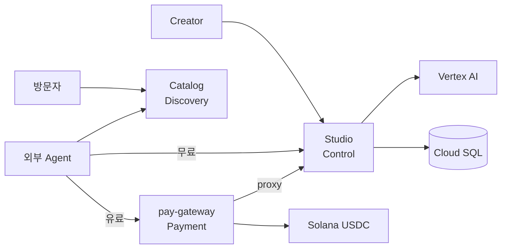

- Studio가 만들고, Catalog가 보여주고, gateway가 유료 호출을 결제·중계한다.
- Catalog는 Gateway를 호출하지 않는다 — `invoke_url`만 알려준다.
- AI·DB는 GCP 안. 결제는 Solana Devnet USDC.

---

## Slide 2 — 에이전트 생성 (Create)

**제목 제안:** Agent Create — 지식 → vault → listing

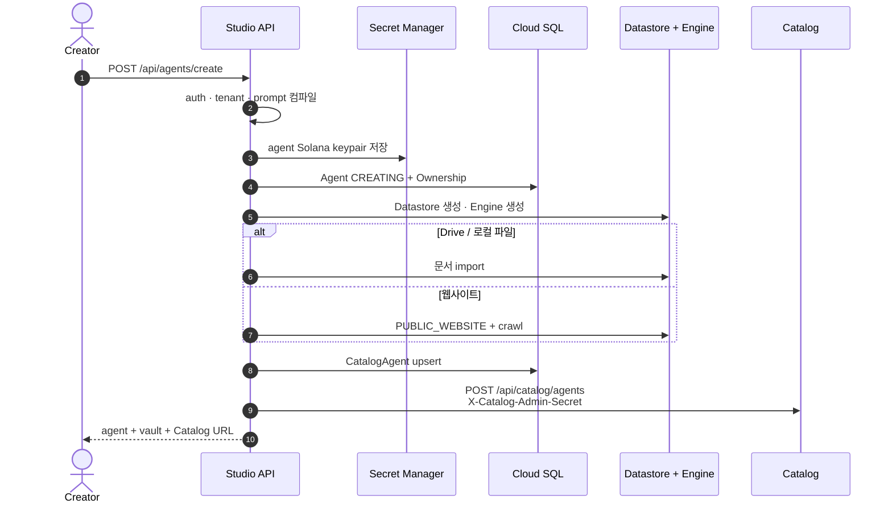

- 유료 listing의 `invokeUrl` = `https://<gateway>/v1/agents/{id}/invoke`
- 무료 listing의 `invokeUrl` = `https://<studio>/api/agents/{id}/invoke`
- 실패 시 Agent 삭제·listing unlist (보상 삭제 일부 제한 있음)

---

## Slide 3 — 에이전트 CRUD · 수명주기

**제목 제안:** Agent lifecycle — update / unlist / delete

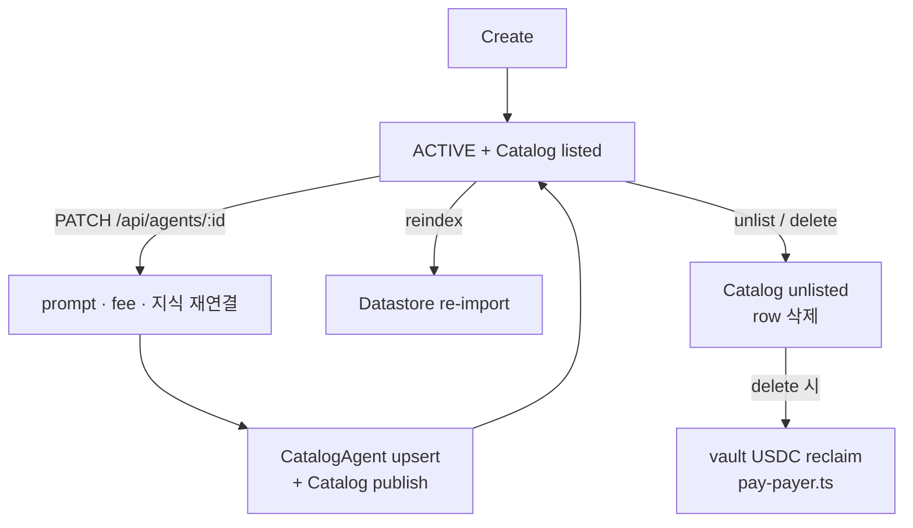

| 동작 | API / 코드 | 부수 효과 |
|---|---|---|
| Create | `POST /api/agents/create` | vault · Datastore · Engine · listing |
| Update | `PATCH /api/agents/:id` | listing 재동기화 |
| Reindex | `POST /api/agents/:id/reindex` | 지식 재적재 |
| Unlist | Catalog unlist / delete 경로 | marketplace에서 제외 |
| Delete | `DELETE /api/agents/:id` | listing 제거 · vault reclaim |

연결 키: `Agent.id = AgentOwnership.agentId = CatalogAgent.agentId`

---

## Slide 4 — Discovery (Catalog)

**제목 제안:** 기계가 읽는 상점 — Catalog discovery

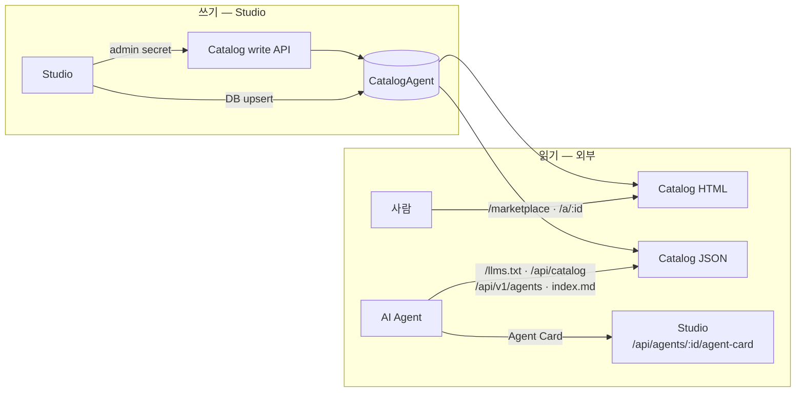

| Surface | URL |
|---|---|
| 가이드 | `/llms.txt` |
| 목록 | `/api/catalog`, `/api/v1/agents` |
| 상세 | `/api/solvamos/:id`, `.../index.md` |
| Card | Studio `/api/agents/:id/agent-card` |

- `price`는 힌트. 결제 진실은 라이브 **HTTP 402**.
- Catalog는 RAG·결제를 하지 않는다.

---

## Slide 5 — 유료 Public Invoke (커머스 레일)

**제목 제안:** Paid invoke — 402 → USDC → Studio

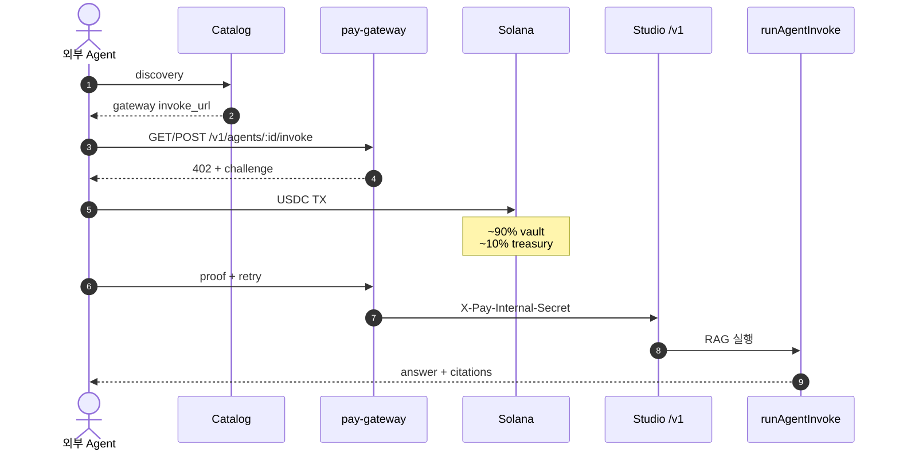

```text
유료 public     →  pay-gateway only
유료 + Studio origin 직접  →  402 + gateway URL (실행 안 함)
Gateway → Studio →  /v1/agents/:id/invoke + X-Pay-Internal-Secret
```

- gateway: `pay/solvamos-provider.*.yml` (pay.sh · x402/MPP)
- 정산 기록: `gateway-settle.ts` → `PaymentSettlement` (부분 연결)

---

## Slide 6 — 무료 Invoke · Owner Test

**제목 제안:** Free path vs Owner test

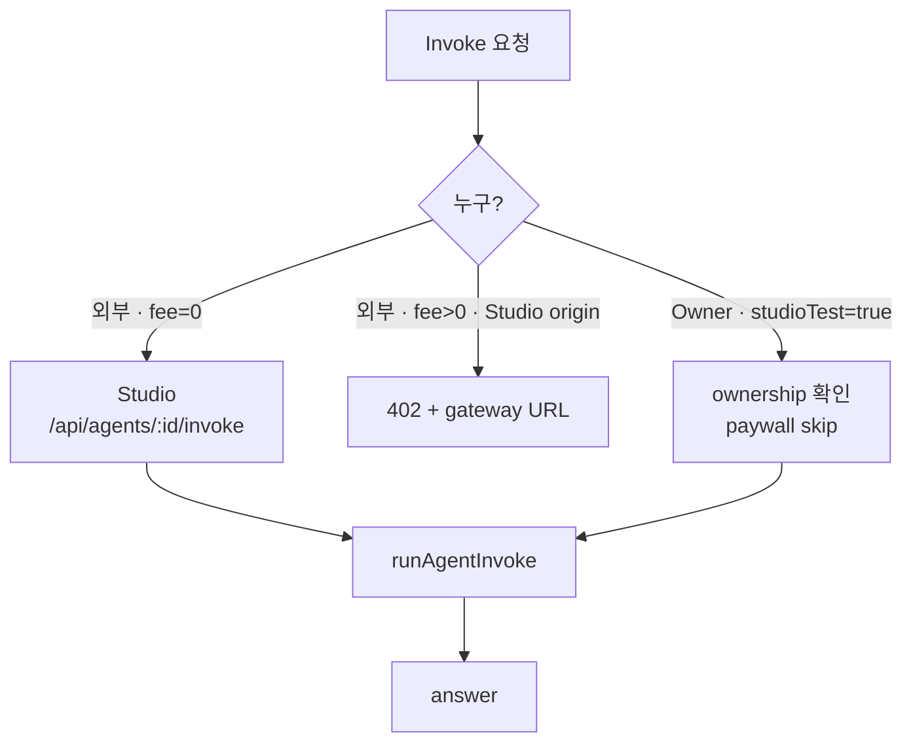

- Owner test는 **이 에이전트** paywall만 생략. peer 유료 호출은 vault에서 나간다.
- Owner test는 API Calls / Est. Revenue를 올리지 않는다 (`bumpInvoke` skip).

---

## Slide 7 — A2A Peer Orchestration

**제목 제안:** A2A — self → free peer → paid peer

> 제품 내부 오케스트레이션 (`server/a2a.ts`). Google A2A JSON-RPC 아님.

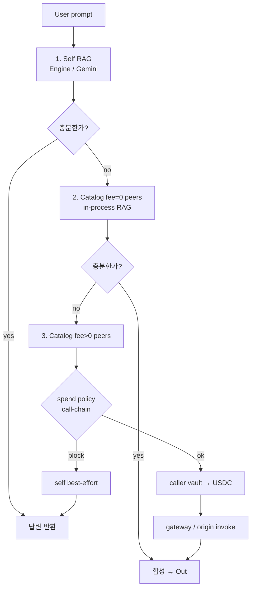

| 단계 | 비용 | 실행 |
|---|---|---|
| Self | 0 | 자기 Datastore/Engine |
| Free peer | 0 | 같은 Studio in-process RAG |
| Paid peer | fee USDC | vault 결제 후 gateway/origin invoke |
| 결제 실패 | — | 사용자 답 전체 실패 금지 · self best-effort |

- 후보: Catalog listing cache (`listCatalogForA2A`)
- 가드: `spend-policy.ts` (per-call / daily / loop)
- 최대 peer hop 제한 있음 (`MAX_PEER_CALLS`)

---

## Slide 8 — A2A 유료 Peer 결제 상세

**제목 제안:** Paid peer — agent vault가 고객이 된다

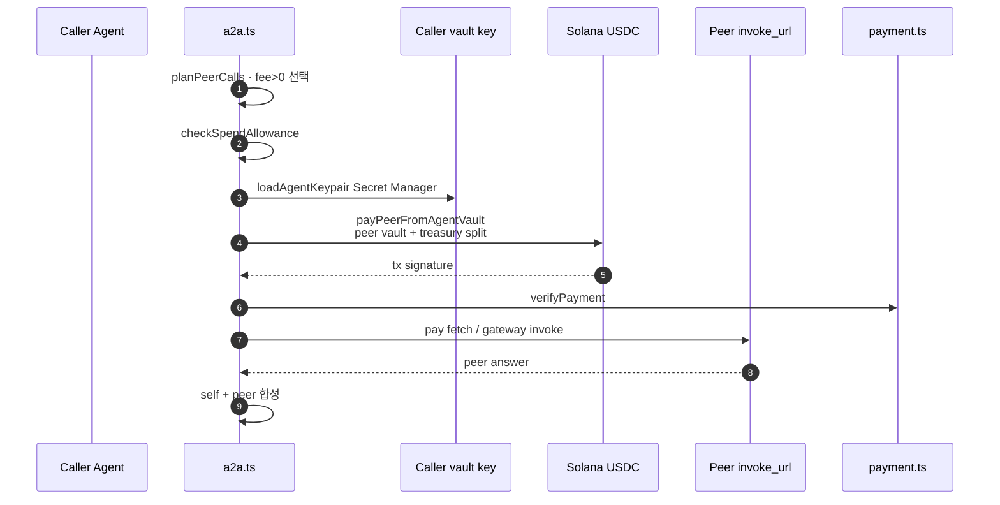

- 공개 커머스와 **같은 정산 레일** (USDC · vault · treasury).
- Caller의 `maxSpendPerCallUsdc` / `dailyBudgetUsdc`로 한도.
- `callChain`으로 순환 호출 차단.

---

## Slide 9 — RAG Runtime 분기

**제목 제안:** 답변 경로 — 하나의 모델 호출이 아니다

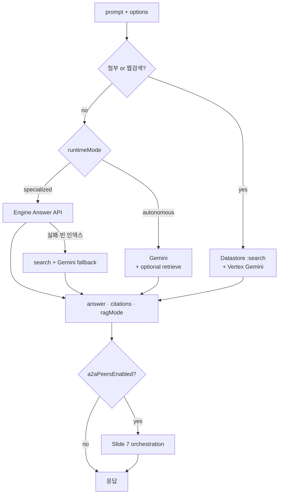

| 모드 | 우선 경로 |
|---|---|
| specialized | AI Applications Answer API |
| autonomous | Vertex Gemini (+ Datastore) |
| 첨부 / Search | Datastore search + Gemini tools |
| peer on | Slide 7 |

코드: `invoke-handler.ts` → `orchestrateA2ATurn` → `rag.ts` / `vertex-*.ts`

---

## Slide 10 — Vault · Treasury · Withdraw

**제목 제안:** 돈의 위치 — Wallet ≠ Vault ≠ Treasury

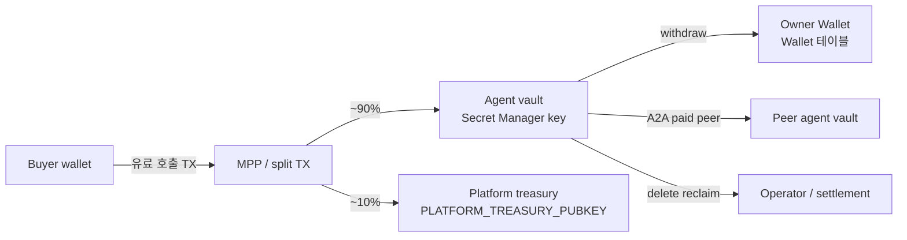

| 지갑 | 역할 |
|---|---|
| Owner `Wallet` | 표시·연결·출금 목적지 (Phantom 등) |
| Agent vault | 수익 수취 · A2A 결제 출금 |
| Platform treasury | 플랫폼 수수료 |
| Operator / settlement | ATA rent · 선택적 fee_payer |

코드: `vault.ts`, `pay-payer.ts`, `payment.ts`, `pay/*.yml`

---

## Slide 11 — Auth · Tenancy (현재 vs 목표)

**제목 제안:** 누가 쓰는가 — shared Lab → isolated project

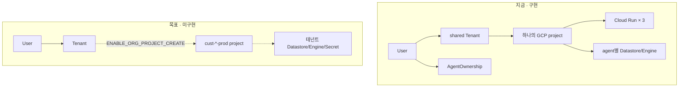

| | Lab 지금 | 목표 |
|---|---|---|
| Project | 1개 shared | 고객별 GCP project |
| 격리 | ownership / tenant row | project 경계 |
| Flag | `TENANCY_MODE=shared` | `isolated` (기본 off) |

인증: email/password + Google OAuth · Drive `drive.readonly` · HttpOnly session.

---

## 슬라이드 구성 추천 순서

1. 역할 조감  
2. Agent Create  
3. CRUD lifecycle  
4. Discovery  
5. Paid public invoke  
6. Free / Owner test  
7. A2A orchestration  
8. A2A paid peer 결제  
9. RAG runtime  
10. Vault / treasury  
11. Auth · tenancy  

발표 시간이 짧으면 **1 → 2 → 5 → 7 → 9 → 10** 여섯 장으로 압축.
