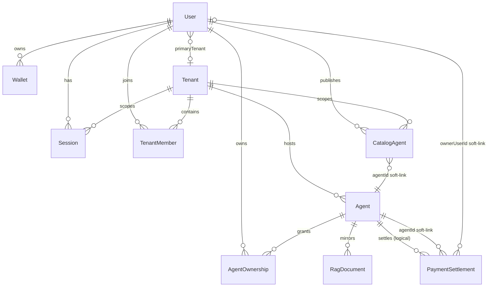
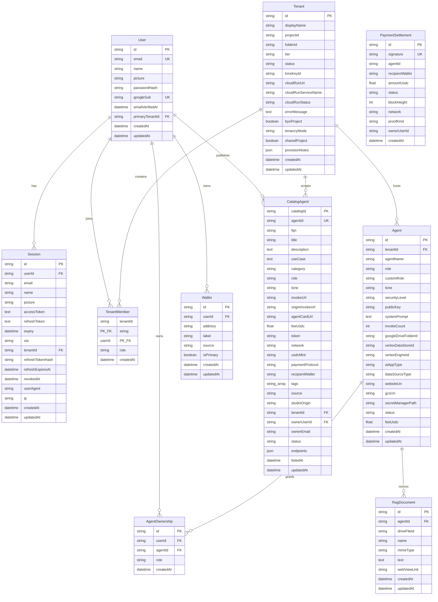

# SolVamos Studio — Database ER Diagram

> 기준: 2026-07-25  
> Source of truth: `prisma/schema.prisma`  
> Engine: PostgreSQL (Cloud SQL) + Prisma

`PaymentSettlement` 포함 전체 스키마는 `npx prisma migrate deploy`로 반영한다.  
Catalog는 동일 Cloud SQL의 `CatalogAgent`를 읽되 **migration은 Studio만** 실행한다.

## Overview



## Entity detail



## Soft links (no DB FK)

| From | To | Key | Notes |
|------|----|-----|--------|
| `CatalogAgent.agentId` | `Agent.id` | soft | marketplace projection ↔ runtime agent |
| `PaymentSettlement.agentId` | `Agent.id` | soft | settlement UI / ownership filter |
| `PaymentSettlement.ownerUserId` | `User.id` | soft | optional denormalized owner |

FK로 묶지 않는 이유: Catalog·gateway 경로에서 agent lifecycle과 settlement ingest 순서가 어긋나도 listing/receipt가 orphan으로 남지 않게 하기 위함이다.

## Tables checklist

| Table | Purpose |
|-------|---------|
| `User` | platform identity |
| `Session` | cookie/JWT session + Drive OAuth |
| `Tenant` / `TenantMember` | workspace |
| `Agent` | runtime RAG agent + vault |
| `AgentOwnership` | user ↔ agent ACL |
| `Wallet` | operator Solana addresses |
| `CatalogAgent` | public marketplace listing |
| `RagDocument` | Drive/local text mirror |
| `PaymentSettlement` | verified pay receipts |

## Apply / verify

```bash
# Studio only
npx prisma migrate deploy
npx prisma migrate status
```

`PaymentSettlement`는 migration `20260724160000_payment_settlements`에서 생성된다.
